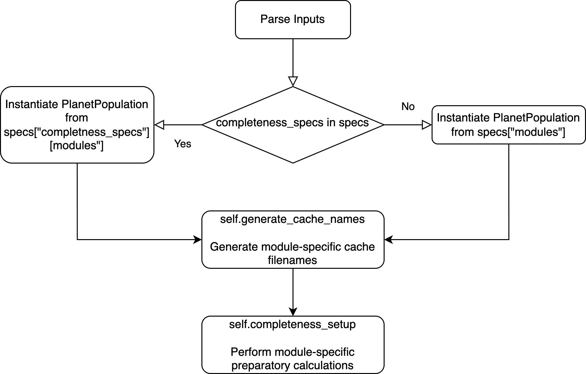

.. _completeness:

Completeness
================

The completeness module is responsible for computing the photometric and obscurational :term:`completeness` [Brown2005]_ of target stars. There are primarily two approaches to performing these computations:

#. Via Monte Carlo methods, as in the original [Brown2005]_ reference.  This is implemented in :py:mod:`EXOSIMS.Completeness.BrownCompleteness`.
#. Semi-analytically, as in [Garrett2016]_. This is implemented in :py:mod:`EXOSIMS.Completeness.GarrettCompleteness`.

Because the computations in either approach are so intensive, the completeness prototype actually does not perform any calculations at all, rather returning a constant value of completeness for all targets.  This is useful in cases where you wish to instantiate a full survey simulation (or any other module requiring a ``Completeness`` object) but do not actually need the completeness values.  Use of the prototype completeness in these cases will significantly speed things up.  However, for running real survey simulations, another implementation must be used. 

Initialization
------------------

:numref:`fig:comp_init_flowchart` shows the initialization of the  :py:class:`~EXOSIMS.Prototypes.Completeness` prototype.

.. _fig:comp_init_flowchart:

   Initialization of a Completeness module.

If the :ref:`sec:inputspec` includes attribute ``completeness_specs`` (see :ref:`the next section<completeness_specs>`) then a :ref:`PlanetPopulation` and :ref:`PlanetPhysicalModel` will be generated based on the contents of that attribute. Otherwise, those modules will be generated from the standard modules list.  Afterwards, two class methods will be called in succession:

#. :py:meth:`~EXOSIMS.Prototypes.Completeness.Completeness.generate_cache_names`: Generate filenames for any caching to be done by the completeness module
#. :py:meth:`~EXOSIMS.Prototypes.Completeness.Completeness.completeness_setup`: Perform any implementation-specific computations required by the completeness module. 

Both of these methods have returns, and set class attributes only.  This allows for simple overloading of the particular computations to be executed.

.. _completeness_specs:

Different Planet Populations for Completeness
--------------------------------------------------

EXOSIMS allows for the calculation of completeness using a different
planet population and/or physical model from the one used to populate
the simulated universe used in the survey simulation.
This functionality is intended to simulate the effects of our current
lack of knowledge of the true planet population. The functionality is
enabled by adding an optional ``completeness_specs`` dictionary to the
:ref:`sec:inputspec`. This sub-dictionary must contain its own sub-dictionary
called ``modules``, containing keys for ``PlanetPopulation`` and (optionally)
``PlanetPhyiscalModel``, as well as any inputs to be passed on instantiation
of these modules.

Below is an example of (part of) the input specification
utilizing this functionality:

::

   {
     "completeness_specs":{
       "eta":1,
       "modules":{
         "PlanetPopulation": "JupiterTwin",
         "PlanetPhyiscalModel":" "
     },
   ...
     "modules": {
       "PlanetPopulation": "KeplerLike2",
       "StarCatalog": "EXOCAT1",
       "OpticalSystem": "Nemati",
       "ZodiacalLight": "Stark",
       "BackgroundSources": " ",
       "PlanetPhysicalModel": "Forecaster",
       "Observatory": "WFIRSTObservatoryL2",
       "TimeKeeping": " ",
       "PostProcessing": " ",
       "Completeness": "BrownCompleteness",
       "TargetList": " ",
       "SimulatedUniverse": "KeplerLikeUniverse",
       "SurveySimulation": "SLSQPScheduler",
       "SurveyEnsemble": " "
     }
   }

In this example, the target completeness will be evaluated using
the :py:mod:`~EXOSIMS.PlanetPopulation.JupiterTwin` planet population 
with the prototype physical model.  The simulated universe, on the other hand,
will be populated based on the :py:mod:`~EXOSIMS.PlanetPopulation.KeplerLike2`
planet population and the :py:mod:`~EXOSIMS.PlanetPhysicalModel.Forecaster`
planet physical model.  Note also that the :py:mod:`~EXOSIMS.PlanetPopulation.JupiterTwin` 
population will be instantiated with input 
``eta=1``, whereas the :py:mod:`~EXOSIMS.PlanetPopulation.KeplerLike2` instance will not get 
this input (in order to set the ``eta`` input for the planet population listed in the main modules dictionary,
it would have to be set elsewhere in the input specification, outside of the ``completeness_specs`` dictionary).  

This specific example is illustrating a fairly common use case: optimizing the survey for a particular sub-population
of planets (in this case Jupiter analogs), but running the survey simulation on a synthetic universe populated by all 
types of planets.

In the case where the ``completeness_specs`` dictionary is omitted, the default behavior is to use 
the same planet population and physica model for all modules that need them.  The behavior in the presence of ``completeness_specs`` is shown schematically in :numref:`fig:instantiation_tree_compspecs`,

.. _fig:instantiation_tree_compspecs:

   
   The same schematic representation as in :numref:`fig:instantiation_tree`, but in the case where the :ref:`sec:inputspec` includes a ``completeness_specs`` dictionary.  In this case, the ``PlanetPopulation`` and ``PlanetPhysicalModel`` objects accessed as attributes of the ``Completeness`` object (i.e., ``Completeness.PlanetPopulation``) are distinct from the ones accessed as attributes of the ``TargetList`` object.  In the default behaivor (as in  :numref:`fig:instantiation_tree`), they are the same objects, such that ``TargetList.PlanetPopulation is TargetList.Completeness.PlanetPopulation`` evaluates to True.  In this case, however, the same statement would evaluate as False.

