.. _concepts:

Fundamental Concepts
##########################

This is a brief summary of fundamental physical concepts underlying the code, and how they are treated in the code.  Many more details are available in the :ref:`refs`.

.. _orbgeom:
   
Orbit Geometry
========================

An exoplanet in ``EXOSIMS`` is defined via a set of scalar orbital and physical parameters. For each target star :math:`S`, we define a reference frame  :math:`\mathcal{S} = (\mathbf{\hat s}_1, \mathbf{\hat s}_2, \mathbf{\hat s}_3)`, with :math:`\mathbf{\hat s}_3` pointing along the vector from the observer to the star (:math:`\mathbf{\hat{r}}_{S/\textrm{observer}} \equiv -\mathbf{\hat{r}}_{\textrm{observer}/S}`) such that the plane of the sky (the plane orthogonal to the this vector lies in the :math:`\mathbf{\hat s}_1-\mathbf{\hat s}_2` plane, as in :numref:`fig:orbit_diagram`.  The :math:`\mathcal{S}` frame is fixed at the time of mission start, and does not evolve throughout the mission simulation, making :math:`\mathcal{S}` a true inertial frame. While the orientation of :math:`\mathbf{\hat s}_3)` is arbitrary, we take it to be the same inertially fixed direction for all targets (by default equivalent to celestial north). 

.. _fig:orbit_diagram:
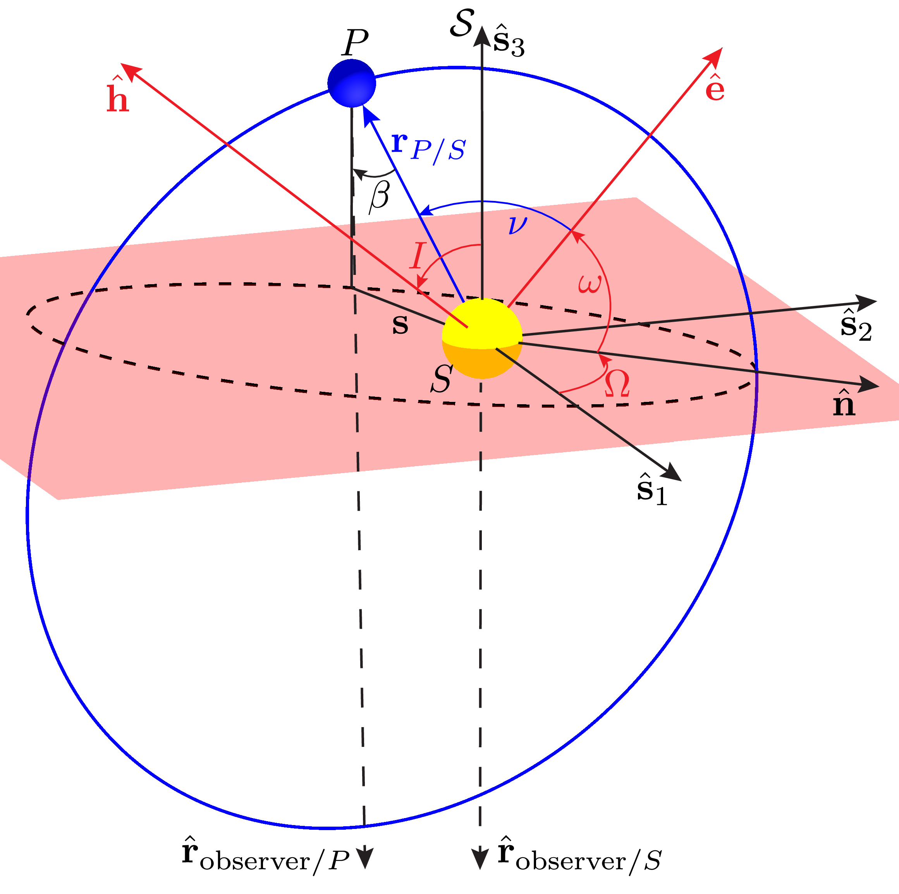

   Exoplanetary system orbit diagram.

The planet's orbit is defined via Keplerian orbital elements, where :math:`a` is the semi-major axis, :math:`e` is the eccentricity, and the orbit's orientation in the  :math:`\mathcal{S}` frame is given by  3-1-3 :math:`(\Omega,I,\omega)` Euler angle set (the longitude of the ascending node, the inclination, and the argument of periapsis, respectively).  By default, all of these quantities are considered to be constant (i.e., no orbital evolution due to perturbations or mutual gravitational effects in multi-planet systems), but the code may be extended to account for these effects, in which case they should be treated as the osculating values at epoch. 

The planet's instantaneous location at time :math:`t` is given by the true anomaly :math:`\nu(t)`.  The orbit (or osculating orbit, in cases where perturbations are allowed) is fully characterized by a simultaneous measurement of the orbital radius and velocity vectors.  The orbital radius vector is given by:

   .. math::
        
        \mathbf{r}_{P/S} = \left[\begin{matrix}- \sin{\left(\Omega \right)} \sin{\left(\theta \right)} \cos{\left(I \right)} + \cos{\left(\Omega \right)} \cos{\left(\theta \right)}\\\sin{\left(\Omega \right)} \cos{\left(\theta \right)} + \sin{\left(\theta \right)} \cos{\left(I \right)} \cos{\left(\Omega \right)}\\\sin{\left(I \right)} \sin{\left(\theta \right)}\end{matrix}\right]

where :math:`r` is the orbital radius magnitude:

   .. math::
        
        r \equiv \Vert  \mathbf{r}_{P/S} \Vert =  \frac{a(1 - e^2)}{1 + e\cos\nu}

and :math:`\theta` is the argument of latitude, :math:`\theta \triangleq \nu + \omega`. The orbital velocity vector is given by:

   .. math::
        
        \mathbf{v}_{P/S} = \sqrt{ \frac{\mu}{a}} \sqrt{\frac{1}{1 - e^{2}}} \left[\begin{matrix}- e \sin{\left(\Omega \right)} \cos{\left(I \right)} \cos{\left(\omega \right)} - e \sin{\left(\omega \right)} \cos{\left(\Omega \right)} - \sin{\left(\Omega \right)} \cos{\left(I \right)} \cos{\left(\theta \right)} - \sin{\left(\theta \right)} \cos{\left(\Omega \right)}\\- e \sin{\left(\Omega \right)} \sin{\left(\omega \right)} + e \cos{\left(I \right)} \cos{\left(\Omega \right)} \cos{\left(\omega \right)} - \sin{\left(\Omega \right)} \sin{\left(\theta \right)} + \cos{\left(I \right)} \cos{\left(\Omega \right)} \cos{\left(\theta \right)}\\\left(e \cos{\left(\omega \right)} + \cos{\left(\theta \right)}\right) \sin{\left(I \right)}\end{matrix}\right]

where :math:`\mu` is the gravitational parameter: :math:`\mu \triangleq G(m_S + m_P)` for gravitational constant :math:`G` and star and planet masses  :math:`m_S` and :math:`m_P`, respectively.  Internally, ``EXOSIMS`` stores the standard gravitational parameters of the stars and planets: :math:`\mu_S = G m_S` and :math:`\mu_P = G m_P`, respectively.  Each planet has only a 'true' mass, whereas for each target star, we generate a 'true' and 'estimated' mass, based on a fit to the star's luminosity, and the known error statistics of that fit.

An imaging detection measures the projection of the orbital radius onto the plane of the sky, which is known as the projected separation vector, :math:`\mathbf{s} = \mathbf{r}_{P/O} - \mathbf{r}_{P/O} \cdot \mathbf{\hat e}_3`.  The projected separation is the magnitude of this vector, and is given by:

    .. math::
        
        s \triangleq \Vert\mathbf{s}\Vert = r \sqrt{1 - \sin^{2}{\left(I \right)} \sin^{2}{\left(\theta \right)}}

The calculation of this value from Keplerian orbital elements is provided in EXOSIMS by method :py:meth:`~EXOSIMS.util.planet_star_separation.planet_star_separation`. The angular separation associated with the projected separation can be calculated as: 
     
   .. math::

      \alpha = \tan^{-1}\left( \frac{s}{d} \right)

where :math:`d` is the distance between the observer and the target star.  In the small angle approximation (which applies in essentially all cases) this can be simplified to :math:`s/d`. EXOSIMS typically does not make such small angle approximations (other than when explicitly noted, as in the case of the phase angle - see :ref:`below<betacalcref>`), just in case you're trying to do something weird. And because we can.

.. _photometry:
   
Photometry
========================

In general, spectral flux density in a given observing band can be approximated as:

.. _fluxdenscalcref:
   
   .. math::
      
      f = \mc{F_0} 10^{-0.4 m}

where :math:`\mc{F_0}` is the band-specific zero-magnitude spectral flux density (vegamag, by convention), and :math:`m` is the band-specific apparent magnitude of the observed object. Multiplying :math:`f` by the bandwidth (:math:`\Delta\lambda`) of the observing band (see: :ref:`observing_bands`) gives the approximate flux for the observation:

   .. math::
      
      F = f\Delta\lambda

Further scaling by the effective collecting area (:math:`A`), all other system throughput losses (:math:`\tau`), and detector quantum efficiency (QE) gives the count rate for the observation in counts/second (or electrons per second):

   .. math::
      
      C = F A \tau \textrm{QE}

``EXOSIMS`` utilizes photon-wavelength units for spectral flux densities by default (akin to IRAF/synphot ``photlam``; see: https://synphot.readthedocs.io/en/latest/synphot/units.html) but with arbitrary area and wavelength units.  Spectral flux densities are thus typically encoded with default units of either :math:`\textrm{ photons m}^{-2}\textrm{ s}^{-1}\, \textrm{nm}^{-1}` or ``photlam``, which is :math:`\textrm{ photons cm}^{-2}\textrm{ s}^{-1}\, \mathring{A}^{-1}`. As all quantities have associated units, unit conversion is automatic and occurs as needed in all calculations, and there is never an ambiguity in the units of a particular quantity. See :ref:`OpticalSystem` for further details.

Stellar Photometry
---------------------

Following the :ref:`equation<fluxdenscalcref>` above, a star's spectral flux density in a given observing band can be approximated as:

   .. math::
      
      f = \mc{F_0} 10^{-0.4 m_S}

where :math:`m_S` is the star's apparent magnitude in the observing band. If the observing band happens to match (or nearly match) a band where the apparent magnitude of a target star is already known, then both :math:`\mc{F_0}` and :math:`m_S` can simply be looked up from cataloged values, which was the approach in ``EXOSIMS`` pre-2016.  However, one of the major use cases of ``EXOSIMS`` is the analysis of observations in a variety of narrow (and possibly non-standard) bands, which requires better modeling to achieve sufficient fidelity of results.  

Between software versions 1.0 and 2.0, ``EXOSIMS`` solely utilized the empirical relationships from [Traub2016]_ to evaluate stellar fluxes in arbitrary bands. The equations in that work (Sec. 2.2) are equivalent to:

   .. math::
   
      \begin{split}  \mc{F_0} &= 10^{4.01 - \left(\frac{\lambda_0}{1\mu\mathrm{m}} - 0.55\right)/0.77} \, \textrm{ photons cm}^{-2}\textrm{ s}^{-1}\, \mathrm{nm}^{-1} \\ 
      m_S &= V + b(B-V)\left(\frac{1 \mu\mathrm{m}}{\lambda_0} - 1.818\right)
      \end{split}

where :math:`\lambda_0` is the center of the observing bandpass (or average wavelength, or effective wavelength), :math:`V` is the target's apparent Johnson-V band magnitude, :math:`B-V` is the target's B-V color, and scaling factor :math:`b` is given by:

   .. math::
      
      b = \begin{cases} 2.20 & \lambda < 0.55\,\mu\textrm{m}\\ 1.54 & \textrm{else} \end{cases}

[Traub2016]_ states that this parametrization is limited to the range :math:`0.4\,\mu\mathrm{m} < \lambda < 1.0\,\mu\mathrm{m}` and that fluxes calculated in this way are accurate to within approximately 7% in this range. The equations are implemented in EXOSIMS in :py:meth:`~EXOSIMS.util.photometricModels.TraubStellarFluxDensity`.

.. _fig:Traub_v_Vega_F0:
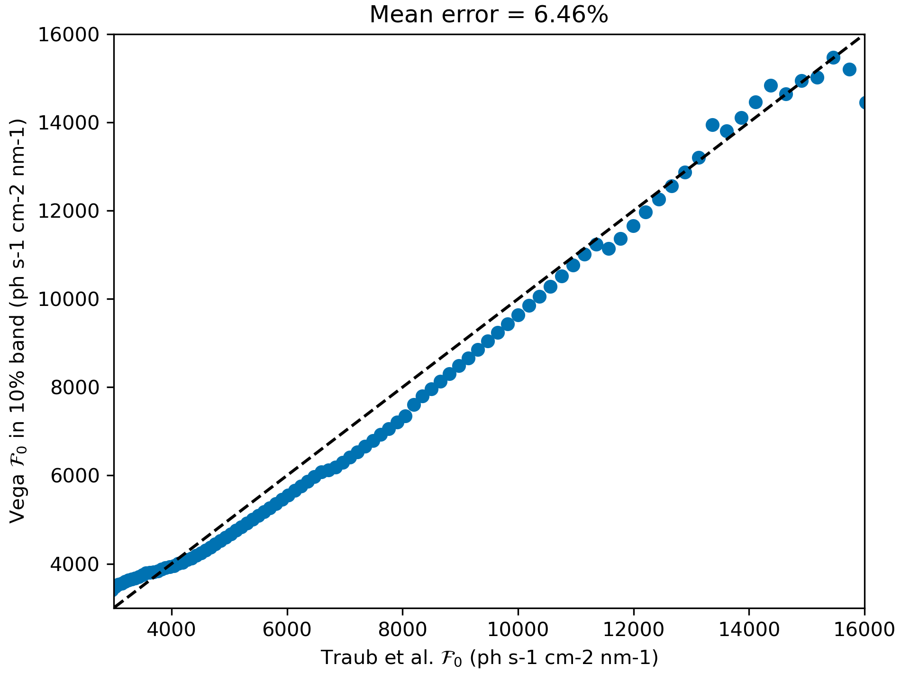
    
   :math:`\mc F_0` computed using the [Traub2016]_ equation compared with Vega's spectral flux density in a 10% band for  :math:`0.4\,\mu\mathrm{m} < \lambda < 1.0\,\mu\mathrm{m}`.

:numref:`fig:Traub_v_Vega_F0` shows a comparison of the zero-magnitude spectral flux density computed from the [Traub2016]_ equation, compared to a calculation of Vega's spectral density in a 10% band for the full valid wavelength range of the [Traub2016]_ equations, using the spectrum of Vega shown in :numref:`fig:pickles_bpgs_G0V` (``synphot``'s default). The values agree to better than 7%, on average, confirming the statements made in the original paper. 

Template Spectra
""""""""""""""""""""
To move beyond the wavelength restrictions of the [Traub2016]_ equations, starting circa version 2.0, ``EXOSIMS`` began augmenting these with flux calculations based on template spectra.

Starting with version 3.1, ``EXOSIMS`` now uses the ``synphot`` package (https://synphot.readthedocs.io/) for handling photometric calculations based on template spectra. This is a highly mature piece of software, with heritage tracing back to STSDAS SYNPHOT in IRAF and PYSYNPHOT in ASTROLIB.  In order to accurately model the stellar flux in any arbitrary observing band for any spectral type, ``EXOSIMS`` makes use of two spectral catalogs:

#. The `Pickles Atlas <https://www.stsci.edu/hst/instrumentation/reference-data-for-calibration-and-tools/astronomical-catalogs/pickles-atlas>`_ (specifically the UVKLIB spectra) - 131 flux calibrated stellar spectra covering all normal spectral types and luminosity classes at solar abundance.
#. The `Bruzual-Persson-Gunn-Stryker Atlas <https://www.stsci.edu/hst/instrumentation/reference-data-for-calibration-and-tools/astronomical-catalogs/bruzual-persson-gunn-stryker-atlas-list>`_ (BPGS).

All Pickles spectra are normalized to 0 magnitude in vegamag in V band, while all BPGS spectra are normalized to a zero visual magnitude. ``EXOSIMS`` preferentially uses the Pickles spectra and only uses BPGS when the spectral type is stated.

.. _fig:pickles_bpgs_G0V:
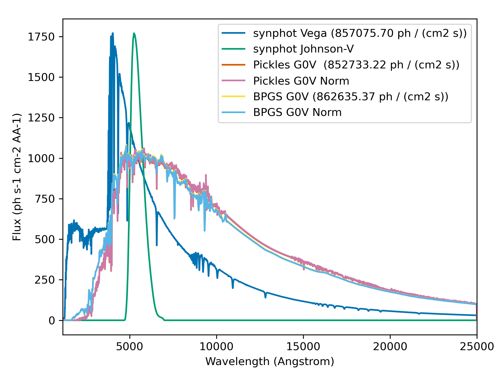
    
   G0V spectra from BPGS, also normalized to zero vegamag using synphot, along with synphot's vega spectrum and Johnson-V bandpass.

:numref:`fig:pickles_bpgs_G0V` shows two G0V spectra pulled from each of the two atlases, along with ``synphot``'s default Vega spectrum and Johnson-V filter profile. The values in the legend represent the total integrated flux of each spectrum in the V-band filter. Re-normalizing to zero vegamag has minimal effect on both spectra, but does highlight the differences between their normalizations and the Vega spectrum used preferentially by ``synphot``. :numref:`fig:pickles_bpgs_G0V_diffs` shows the differences between the original spectra and their normalizations, as well as the difference between the two normalized spectra, which typically agree to within :math:`\sim 100 \textrm{ photons cm}^{-2}\textrm{ s}^{-1}\, \mathring{A}^{-1}`.

.. _fig:pickles_bpgs_G0V_diffs:
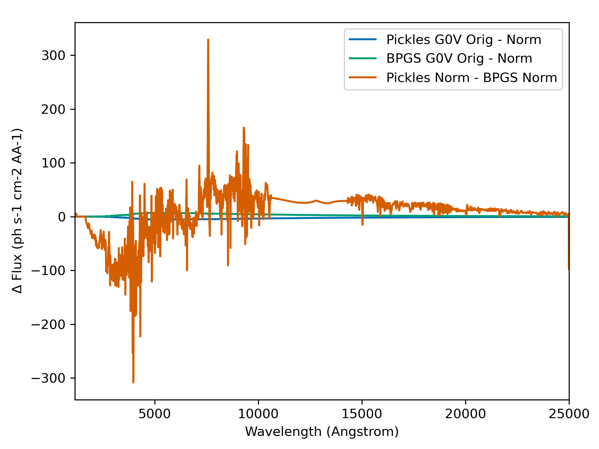
    
   Difference between original and re-normalized G0V spectra from Pickles and BPGS.

The basic procedure for evaluating the stellar flux based on template spectra for a given observing band is:

#. Match the closest available catalog spectrum to the target's spectral type. (At this point we can also optionally apply interstellar reddening, but do not, by default.) 
#. Identify the closest (in wavelength) band (see :numref:`fig:synphot_standard_bands`) to the desired observing band, for which the original star catalog provided an apparent magnitude value.
#. Re-normalize the catalog spectrum to the target star's magnitude in the identified band.
#. Integrate the spectrum over the observing band to find the stellar flux for the observation.

.. important::

    Computing stellar fluxes directly from template spectra bypasses the need to evaluate (or look up) the zero-magnitude flux in the obserivng band.  However, if the zero-magnitude flux is needed for other calculations, it cannot be replaced with the stellar flux, and must be computed separately.

:numref:`fig:traub_v_synphot_Vband` shows a comparison of these two calculations (``synphot`` vs. the [Traub2016]_ equations) for the subset of stars from the EXOCAT star catalog that have spectral types exactly matching entries in the Pickles Atlas.  The fluxes are evaluated for a V-band-like observing band with a central wavelength of 549 nm and a Gaussian-equivalent FWHM of 81 nm.  This equates to a bandwidth of 85.73 nm, which is the value used for scaling the Traub et al. spectral fluxes.  Unsurprisingly (as the original [Traub2016]_ fits were geared towards V band observations) the two calculations have excellent agreement, differing by only about 1%, on average.

.. _fig:traub_v_synphot_Vband:
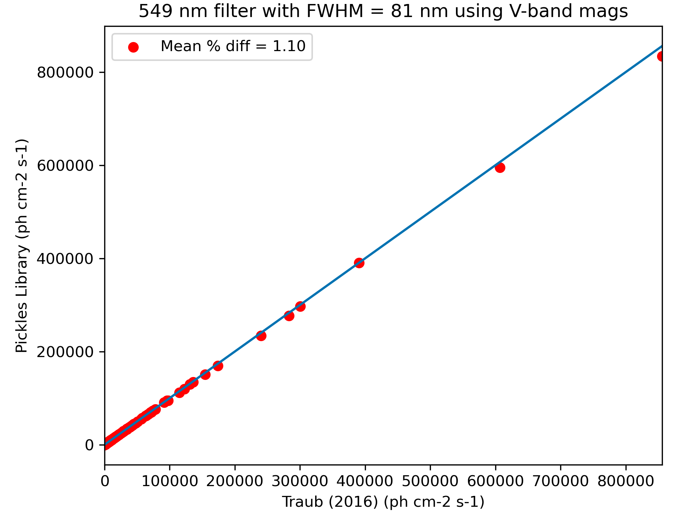
    
   ``synphot`` Stellar flux calculations using Pickles Atlas templates vs. the [Traub2016]_ parametric calculation. The points represent 1327 individual target stars and the reference line has slope 1.

We can repeat this experiment again, this time looking at B-band-like observations (439 nm filter with FWHM of 80 nm and equivalent bandwidth of 85 nm), with results shown in :numref:`fig:traub_v_synphot_Bband`.  IN this case, we perform the ``synphot`` calculations twice: first re-normalizing each target's template spectrum by its cataloged V-band magnitude (in the Johnson-V band) and next re-normalizing the template spectrum by the cataloged B-band magnitude (in the Johnson B-band).  Once again, if we normalize in the appropriate band, the agreement between the template spectrum calculations and the [Traub2016]_ fits agree very well, with average deviations of only a few percent.  Normalizing to V band magnitudes, however, produces averages of 10% error, indicating that use of the empirical relationship may be better in cases where cataloged band magnitudes (or colors) do not exist for a target star.

.. _fig:traub_v_synphot_Bband:
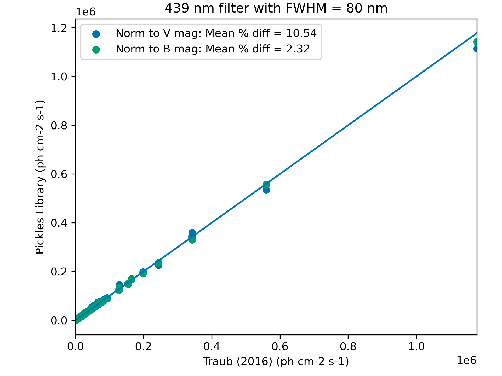
    
   ``synphot`` Stellar flux calculations using Pickles Atlas templates vs. the [Traub2016]_ parametric calculation. The points represent 1327 individual target stars and the reference line has slope 1. One set of points represent ``synphot`` calculations were template spectra were re-normalized by the cataloged target V-band magnitudes, while the other set represents re-normalization by the cataloged B-band magnitudes.

Finally, we can consider the case of an observing band strictly outside of the stated valid range of the [Traub2016]_ equations. We repeat the same calculations as in :numref:`fig:traub_v_synphot_Bband`, but now using K-band magnitudes and a very narrow observing band (2195 nm filter with FWHM of 19 nm and equivalent bandwidth of 20 nm), with results shown in :numref:`fig:traub_v_synphot_Kband`. In this case the ``synphot`` results diverge sharply from the [Traub2016]_ model, with average errors of hundreds of percent, depending on which normalization is used. 

.. _fig:traub_v_synphot_Kband:
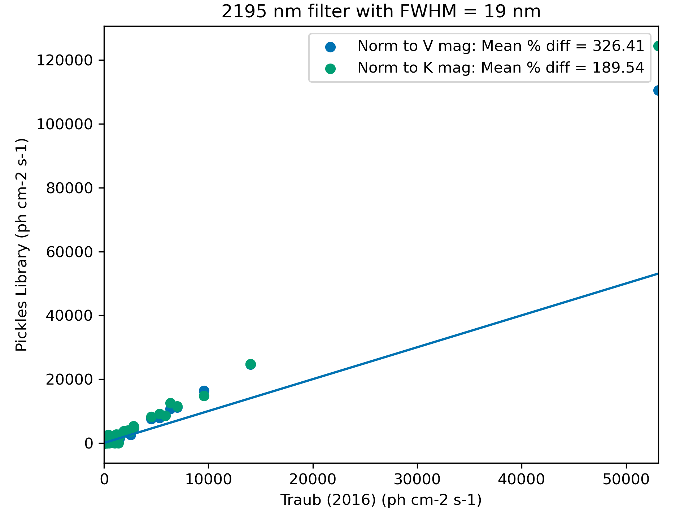
    
   ``synphot`` Stellar flux calculations using Pickles Atlas templates vs. the [Traub2016]_ parametric calculation. The points represent 1285 individual target stars and the reference line has slope 1. One set of points represent ``synphot`` calculations were template spectra were re-normalized by the cataloged target V-band magnitudes, while the other set represents re-normalization by the cataloged K-band magnitudes.

We can also look at the effects of bandwidth on the [Traub2016]_ empirical relationship. :numref:`fig:traub_v_synphot_deltaLambda_errs` shows the percent differences between the stellar fluxes computed via the [Traub2016]_ equations and with ``synphot`` template spectra as a function of fractional bandwidths for different spectral and luminosity classes. The central wavelength in all cases is 600 nm (the center of the stated valid range for the [Traub2016]_ equations). The black dashed line represents the limit of the valid range - past this point, the errors are nearly linear in fractional bandwidth for all spectral types considered here (but especially for all of the main sequence spectra. As the data set used to generate the [Traub2016]_ equations contained primarily dwarf star spectra, it is unsurprising that the equations do a much better job of modeling these spectra than those from other luminosity classes.  However, even in the case of giant spectra, the differences between the two calculations (within the valid wavelength range of the equations) is typically well under 10%.

.. _fig:traub_v_synphot_deltaLambda_errs:
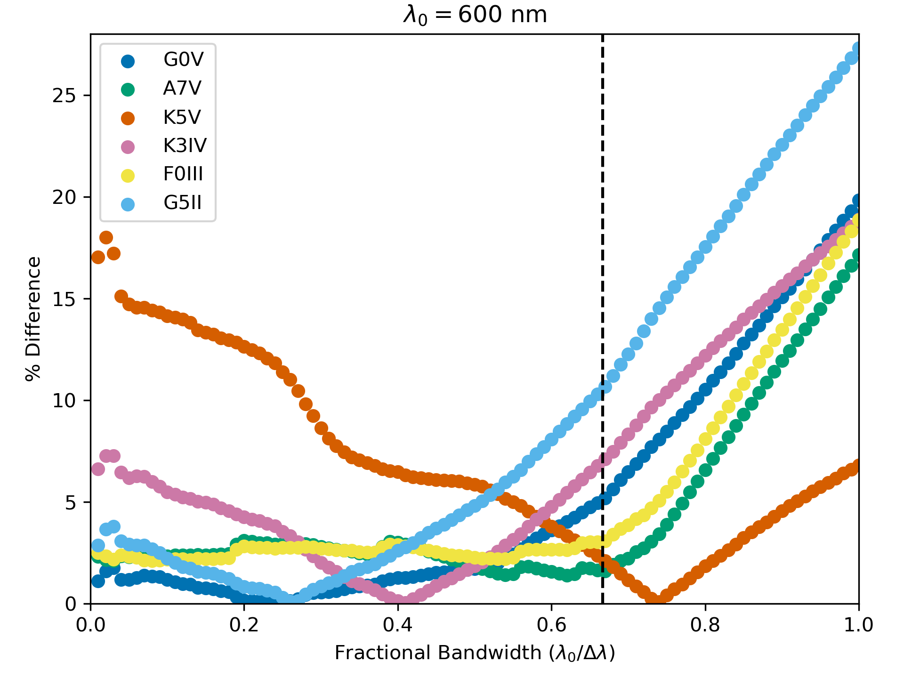
    
   Percent differences between ``synphot`` and [Traub2016]_ stellar fluxes as a function of fractional bandwidth with a central wavelength of 600 nm for three different spectral types. The dashed line represents the limit of the stated region of validity of the [Traub2016]_ equations.

The one exception is the K5V spectrum, which has a qualitatively different pattern of differences from the others.  To check whether this is limited to this specific spectrum, we repeat the same calculations using template spectra spanning the whole main sequence. :numref:`fig:traub_v_synphot_deltaLambda_errs_mainseq` repeats the calculations from :numref:`fig:traub_v_synphot_deltaLambda_errs`, but only for main sequence spectral templates. 

.. _fig:traub_v_synphot_deltaLambda_errs_mainseq:
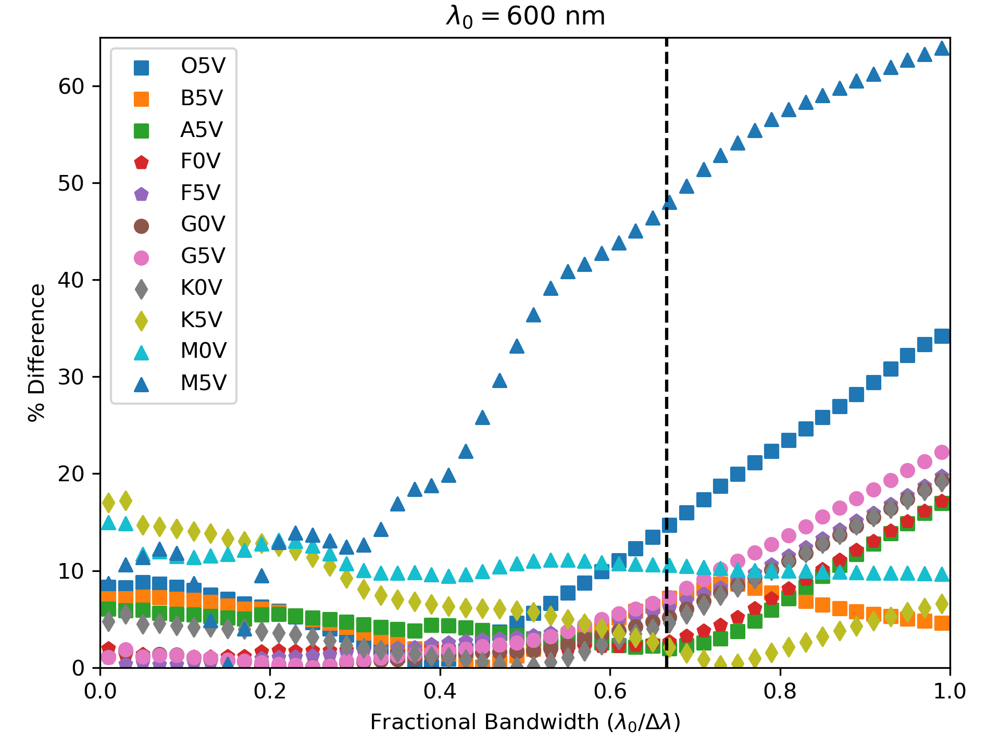
    
   Same as :numref:`fig:traub_v_synphot_deltaLambda_errs`, except using only main sequence spectra.

We can see that the [Traub2016]_ works best for F, G, and early K stars, holds reasonably well for most early-type stars, and starts to diverge significantly for late-type stars, and especially late K and M dwarfs. 

.. _modelingir:

Modeling Mid- to Far-IR Instruments
"""""""""""""""""""""""""""""""""""""

A fundamental limitation of the template spectra is that they extend only to approximately 2.5 :math:`\mu\mathrm{m}`.  If we wish to model instruments operating beyond this wavelength, then we need to either replace our template spectra with ones covering longer wavelengths, or to rely on idealized black-body curves, parameterized by the stellar effective temperature.  By default, ``EXOSIMS`` does the latter. 

As black-body spectra are parametrized by stellar effective temperature, we need to either have these values tabulated in the original star catalog, or to compute them.  Where catalog values are unavailable, ``EXOSIMS`` utilizes the empirical fit from  [Ballesteros2012]_ (Eq. 14), which has the form:

.. math::

   T_\mathrm{eff} = 4600\left(\frac{1}{0.92(B-V) + 1.7} + \frac{1}{0.92(B-V)+0.6}\right) \, \mathrm{K}

To validate this relationship, we use our template spectra, compute their B-V colors, compute the effective temperatures, and then compare the resulting black-body spectra (normalized to the same V magnitude) to the original ones.  In general, we find excellent agreement past 2 :math:`\mu\mathrm{m}`.  :numref:`fig:templates_w_blackbody` shows a sample of this comparison for various spectral and luminosity classes. 

.. _fig:templates_w_blackbody:
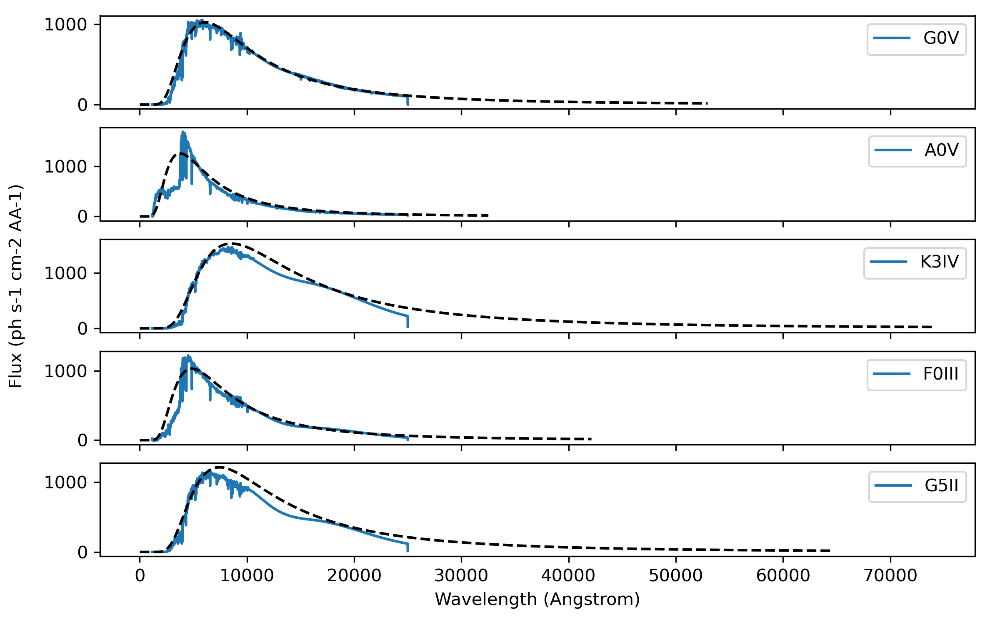
    
   Template spectra with black-body spectra (black dashed lines) for various spectral types, with stellar effective temperature computed using the [Ballesteros2012]_ fit.

Planet Photometry
------------------------

The second quantity observed by direct imaging is the flux ratio between the planet and star: :math:`\frac{F_P}{F_S}`.  This is typically reported in astronomical magnitudes, as the difference in magnitude between star and planet:

    .. math::
        
        \Delta{\textrm{mag}} \triangleq -2.5\log_{10}\left(\frac{F_P}{F_S}\right) =  -2.5\log_{10}\left(p\Phi(\beta) \left(\frac{R_P}{r}\right)^2 \right)

where :math:`p` is the planet's geometric albedo, :math:`R_P` is the planet's (equatorial) radius, and :math:`\Phi` is the planet's phase function (see: :ref:`phasefun`), which is parameterized by phase angle :math:`\beta`.  A planet's flux can therefore be calculated from the star's flux and an assumed :math:`\Delta{\textrm{mag}}` as:

    .. math::
        
        F_P = F_S 10^{-0.4 \Delta\textrm{mag}}

The phase angle is the illuminant-object-observer angle, and therefore the angle between the planet-star vector ( :math:`\mathbf{r}_{S/P} \equiv -\mathbf{r}_{P/S}`) and the planet-observer vector :math:`\mathbf{r}_{\textrm{observer}/P}`, which is given by:

    .. math::
        
        \mathbf{r}_{\textrm{observer}/P} = \mathbf{r}_{\textrm{observer}/S} - \mathbf{r}_{P/S} = -d \mathbf{\hat s}_3 -  \mathbf{r}_{P/S} 

Thus, the phase angle can be evaluated as:
 
   .. math::

      \cos\beta = \frac{-\mathbf{r}_{P/S} \cdot (-d\mathbf{\hat s}_3 - \mathbf{r}_{P/S} )}{r \Vert -d\mathbf{\hat s}_3 - \mathbf{r}_{P/S} \Vert}

If we assume that :math:`d \gg r` (the observer-target distance is much larger than the orbital radius, a safe assumption for all cases), then the planet-observer and star-observer vectors become nearly parallel, and we can approximate :math:`-d\mathbf{\hat s}_3 - \mathbf{r}_{P/S} \approx  -d\mathbf{\hat s}_3`.  In this case, the phase angle equation simplifies to:

   .. math::

      \cos\beta \approx \frac{-\mathbf{r}_{P/S} \cdot -d\mathbf{\hat s}_3}{rd} = \frac{\mathbf{r}_{P/S}}{r} \cdot \mathbf{\hat s}_3

If we evaluate this expression in terms of the components of the orbital radius vector as a function of the Euler angles defined above, we find:

.. _betacalcref:

   .. math::
      
      \cos\beta = \sin I \sin\theta

.. important::

    ``EXOSIMS`` adpots the convention that the observer is *below* the planet of the sky, looking up (i.e., along the positive :math:`\mathbf{\hat s}_3` direction in  :numref:`fig:orbit_diagram`).  This is different from the convention used elsewhere, and especially the convention adopted by the Exoplanet Archive, where the observer is located *above* the planet of the sky, and looking down (i.e., along the negative :math:`\mathbf{\hat e}_3` axis).  Switching conventions has no effect on the calculation of the projected separation, but does flip the sign of the phase angle, such that :math:`\cos\beta = -\sin I \sin\theta`.

It is important to note that not every orbit admits the full range of possible phase angles.  As :math:`\theta` always varies between 0 and :math:`2\pi` for every closed orbit, from the :ref:`equation<betacalcref>`, we see that the phase angle is bounded by the value of the inclination, such that the maximum phase angle falls within the range :math:`\left[\frac{\pi}{2} - I, \frac{\pi}{2} + I\right]`, as shown in :numref:`fig:beta_plot`.  For a face-on orbit (:math:`I = 0`), the only possible phase angle is :math:`\frac{\pi}{2}` (the observer is always at a right angle from the star-planet vector), while an edge-on orbit (:math:`I = \frac{\pi}{2}`), admits the full range of phase angles, :math:`\beta \in [0, \pi]`.

.. _fig:beta_plot:
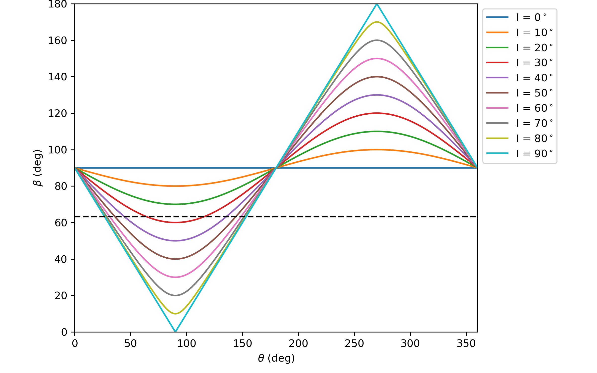

   The range of phase angles that can occur within a given orbit are strictly bounded by the orbit's inclination. 

.. _observing_bands:

Observing Bands
========================

``EXOSIMS`` provides several ways to encode an observing band.  If a specific filter profile is known (i.e., from measurements of an existing filter, or if use of a standard filter is assumed), then all flux calculations can be done utilizing this profile.  Alternatively, if the filter profile is not known exactly, or if the filter definition is at a very early stage of development (i.e., you wish to evaluate a "10% band at 500 nm"), then the filter is internally described either as a box filter (characterized by bandwidth) or a Gaussian filter (characterized by its full-width at half max; FWHM). The bandwidth (:math:`\Delta\lambda`) is defined as:

   .. math::
      
      \Delta\lambda =  \frac{1}{\max_\lambda T} \int_{-\infty}^\infty T \intd{\lambda}

where :math:`T` is the wavelength-dependent transmission of the filter (see [Rieke2008]_ for details). Internally, the variable ``BW`` is typically treated as the fractional bandwidth:

   .. math::
      
      \mathrm{BW} = \frac{ \Delta\lambda }{\lambda_0}

where :math:`\lambda_0` represents the mean (central) wavelength. A Gaussian of amplitude :math:`a` has the functional form:

   .. math::
      
      f(\lambda) = a\exp\left(-\frac{(\lambda - \lambda_0)^2}{2\sigma^2}\right)

where :math:`\sigma` is the standard deviation. The full-width at half max of a Gaussian is given by:

   .. math::
      
      \mathrm{FWHM} = 2\sqrt{2\ln(2)} \sigma

and the integral of the Gaussian is:

   .. math::

      \int_{-\infty}^\infty a\exp\left(-\frac{(\lambda - \lambda_0)^2}{2\sigma^2}\right) \intd{\lambda} = a\sqrt{2\pi} \sigma

meaning that we can relate the bandwidth and FWHM of a Gaussian filter as:

   .. math::
      
      \Delta\lambda = a \sqrt{\frac{\pi}{\ln(2)}} \frac{\mathrm{FWHM}}{2}

:numref:`fig:gauss_box_bandpasses` shows bandwidth-equivalent Gaussian and box filters corresponding to 10% bands at 500 nm and 1.5 :math:`\mu\mathrm{m}` (both with amplitude 1), overlaid on the G0V pickles template from :numref:`fig:pickles_bpgs_G0V`.  The fluxes computed for this spectrum using the two different filter definitions differ by much less than 1% in both cases (0.2% at 500 nm and 0.08% at 1.5 :math:`\mu\mathrm{m}`). 

.. _fig:gauss_box_bandpasses:
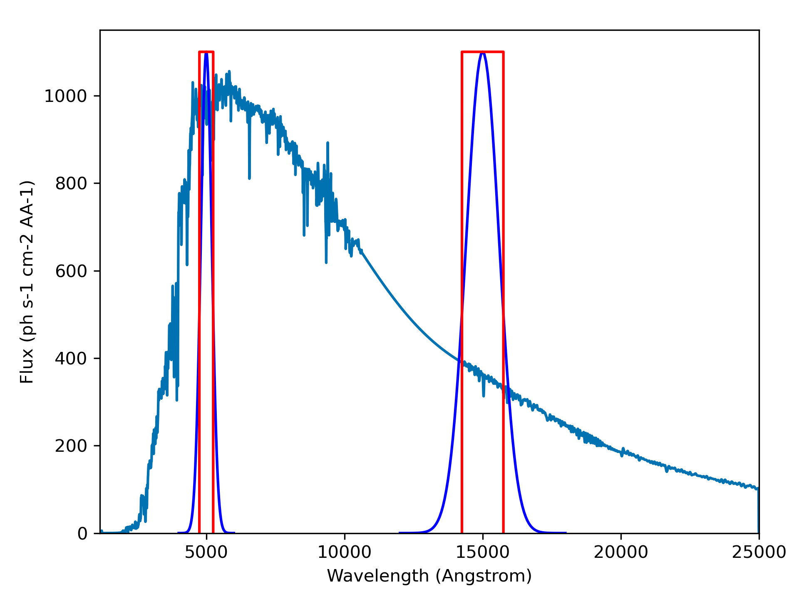
    
   Equivalent bandwidth Gaussian (blue) and box (red) filters for 10% bands centered at 500 nm and 1.5 :math:`\mu\mathrm{m}` overlaid on the G0V spetrum from :numref:`fig:pickles_bpgs_G0V`. The bandpasses have amplitudes of 1 and are arbitrarily scaled for visualization purposes. 

:numref:`fig:synphot_standard_bands` shows the ``synphot`` default filter profiles for the standard Johnson-Cousins/Bessel bands, which are used in the template spectra re-normalization step. 

.. _fig:synphot_standard_bands:
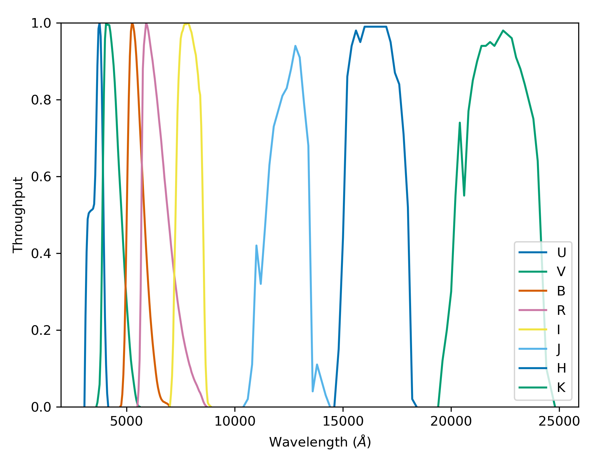
    
   ``synphot`` default band profiles for Johsnson-Cousins and Bessel bands.  UVB are from [Apellaniz2006]_, RI are from [Bessell1983]_, and JHK are from [Bessell1988]_.

.. _phasefun:

Phase Functions
========================

The phase function of a planet depends on the composition of its surface and atmosphere (including any potential clouds), and can be arbitrarily difficult to model.  The simplest possible approximation to the phase function is given by the Lambert phase function, which describes a spherical, ideally isotropic, scattering body (none of which are good assumptions for planets.  The Lambert phase function is given by (see [Sobolev1975]_ for a full derivation):

    .. math::

        \pi\Phi_L(\beta) = \sin\beta + (\pi - \beta)\cos\beta

While not strictly correct for any physical planet, the Lambert phase function has the benefit of being very simple to evaluate. In particular, if assuming this phase function, we can strictly bound the :math:`\Delta{\textrm{mag}}`.  Following [Brown2004]_, the flux ratio (and therefore :math:`\Delta{\textrm{mag}}`) extrema for any phase function can be found by solving for the zeros of the derivative of the flux ratio with respect to the phase angle:

    .. math::
        
        \frac{\partial}{\partial \beta} \left(\frac{F_P}{F_S}\right) = \frac{2 \Phi{\left(\beta \right)} \sin{\left(\beta \right)} \cos{\left(\beta \right)}}{s^{2}} + \frac{\sin^{2}{\left(\beta \right)} \frac{\intd{}}{\intd{\beta}} \Phi{\left(\beta \right)}}{s^{2}} = 0

where we have substituted :math:`r = s/\sin(\beta)` and assumed that both planet radius and geometric albedo are constants. This simplifies to:

    .. math::
        
        2 \Phi{\left(\beta \right)} \cos{\left(\beta \right)} + \sin{\left(\beta \right)} \frac{\intd{}}{\intd{\beta}} \Phi{\left(\beta \right)} = 0

Substituting the Lambert phase function, we find the extrema-generating phase angle to be given by:

    .. math::
        
        - 3 \beta \cos{\left(2 \beta \right)} - \beta + 2 \sin{\left(2 \beta \right)} + 3 \pi \cos{\left(2 \beta \right)} + \pi = 0

which, as shown in :numref:`fig:lambert_extrema`, has a single non-trivial value at :math:`\beta \approx 1.10472882` rad (or 63.2963 degrees).
This is the value shown by the black dashed line in :numref:`fig:beta_plot`.
 
.. _fig:lambert_extrema:
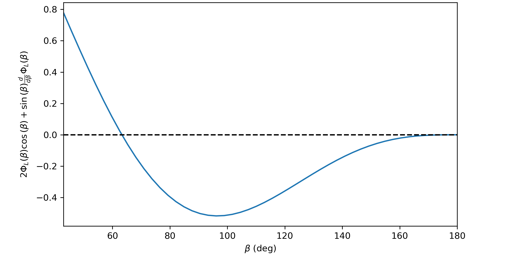
    
   The zeros of this function are the :math:`\beta` values corresponding to flux ratio exterma. 
    

A drawback of the Lambert phase function, however, is that it is not analytically invertible.  An alternative, suggested in [Agol2007]_ is the quasi-Lambert function, which, while not physically motivated, approximates the Lambert phase function relatively well, and has the benefit of analytical invertibility:

    .. math::

        \Phi_{QL}(\beta) = \cos^4\left(\frac{\beta}{2}\right)

For further discussion and other phase functions built into ``EXOSIMS`` see [Keithly2021]_.  All phase functions are provided by methods in :py:mod:`~EXOSIMS.util.phaseFunctions`.

Completeness, Integration Time, and :math:`\Delta{\textrm{mag}}`
========================================================================

Photometric and obscurational completeness, as defined originally in [Brown2005]_, is the probability of detecting a planet from some population (given that one exists), about a particular star, with a particular instrument, upon the first observation of that target (this is also known as the single-visit completeness).  Completeness is evaluated as the double integral over the joint probability density function of projected separation and :math:`\Delta{\textrm{mag}}` associated with the planet population:

    .. math::
        
        c = \int_{0}^{\Delta\mathrm{mag}_\mathrm{max}(s, t_\mathrm{int})} \int_{s_{\mathrm{min}}}^{s_
        \mathrm{max}} f_{\bar{s},\overline{\Delta\mathrm{mag}}}\left(s,\Delta\mathrm{mag}\right) \intd{s} \intd{\Delta\mathrm{mag}}.

The limits on the projected separation are given by the starlight suppression system's inner and outer working angles (:term:`IWA` and :term:`OWA`):

    .. math::
        
        s_\mathrm{min} = \tan\left(\mathrm{IWA}\right) d \qquad  s_\mathrm{max} = \tan\left(\mathrm{OWA}\right) d 

In the small-angle approximation (essentially always appropriate for feasibly starlight suppression systems), these are just :math:`s_\mathrm{min} = \mathrm{IWA} d` and :math:`s_\mathrm{max} = \mathrm{OWA} d`.  For angles given in arcseconds and distances in parsecs, these evaluate to projected separations in AU. 

The lower limit on :math:`\Delta\mathrm{mag}` technically depends on the assumed planet population, but as the density function will be uniformly zero below this limit, it can be taken to be zero for all separations, without loss of generality. The upper limit on :math:`\Delta\mathrm{mag}`, however, is a function of the instrument *and* the integration time (:math:`t_\mathrm{int}`). 

The integration time is typically calculated as the amount of time needed to reach a particular :term:`SNR` with some optical system for a particular :math:`\Delta\mathrm{mag}`.  We can invert this relationship (either analytically or numerically, depending on the optical system model), to compute the largest possible :math:`\Delta\mathrm{mag}` that can be achieved by our instrument on a given star for a given integration time. Since the instrument's performance typically varies with angular separation, we end up with a different :math:`\Delta\mathrm{mag}_\mathrm{max}` for every angular separation even if using a single integration time.

Thus, single-visit completeness is directly a function of integration time.  The relationship is not always invertible, as completeness is strictly bounded (by unity), meaning that completeness will saturate for some value of integration time.  Completeness is also not guaranteed to saturate at unity, for two possible reasons:

#. The projected :term:`IWA` and/or :term:`OWA` for a given star may lie within the bounds of all possible orbit geometries for the selected planet population, such that the maximum obscurational completeness is less than 1.
#. The optical system model may include a noise floor, such that SNR stops increasing with additional integration time past some point.  In this case, :math:`\Delta\mathrm{mag}_\mathrm{max}` will saturate at the noise floor integration time, leading to a maximum photometric completeness of less than 1.

All of this is illustrated in :numref:`fig:compgrid_w_contrast`.  The heatmap shows the joint PDF of the assumed planet population (in log scale) and the three black curves represent  :math:`\Delta\mathrm{mag}_\mathrm{max}(s)` for three different integration times.  All three of the curves have the same limits in :math:`s`, set by the assumed instrument's inner and outer working angles, projected onto one particular target star.  Even though the integration times are logarithmically spaced, we can see that the growth of :math:`\Delta\mathrm{mag}_\mathrm{max}(s)` is not linear on the logarithmic scale of the figure.  In this case, this is due to the particular optical system model employed to generate this data.  This model assumes that SNR increases as approximately :math:`\sqrt{t_\mathrm{int}}`, and that there exists an absolute noise floor.  In this specific case, the noise floor corresponds to an integration time of about 6 days, meaning that any integration time larger than this (including the displayed 10 day curve) will produce exactly the same :math:`\Delta\mathrm{mag}_\mathrm{max}(s)` curve and therefor the same completeness value.

.. _fig:compgrid_w_contrast:
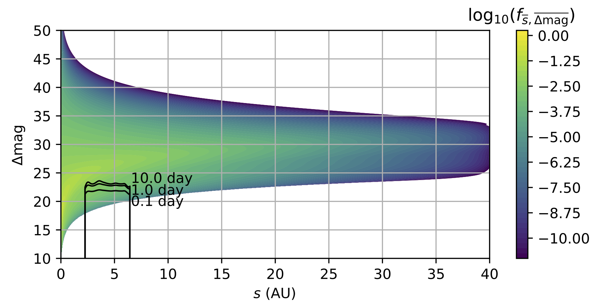

   Joint PDF of projected separation and :math:`\Delta\mathrm{mag}` with  :math:`\Delta\mathrm{mag}_\mathrm{max}` curves for various integration times.

All of this can get very complicated very quickly, and all of these calculations depend on having high-fidelity models of the instrument and the numerical machinery to invert the calculation of :math:`\Delta\mathrm{mag}_\mathrm{max}` as a function of integration time.  It is typical (especially with instrument models that are not yet well-developed) to make the simplifying assumption (as in [Brown2005]_ and others) that :math:`\Delta\mathrm{mag}` is a constant value (sometimes called :math:`\Delta\mathrm{mag}_0` or :math:`\Delta\mathrm{mag}_\mathrm{lim}` in the literature) for all angular separations and for all targets.  In this case, the calculation of completeness is greatly simplified.  This simplification is made in ``EXOSIMS`` by default, but the full calculation is also available. 

``EXOSIMS`` actually keeps track of 3 sets of completeness, integration time, and :math:`\Delta\mathrm{mag}` values:

#. The integration time and completeness corresponding to user selected :math:`\Delta\mathrm{mag}_\textrm{max}` at a particular angular separation from the target (controlled by inputs ``int_dMag`` and ``int_WA`` which can be target-specific or global. This is the default integration time and completeness used in mission scheduling (or as an initial guess for further optimization of integration time allocation between targets).
#. The :math:`\Delta\mathrm{mag}_\textrm{max}` and completeness (stored as ``saturation_dMag`` and ``saturation_comp``, respectively) associated with infinite integration times.  These are the saturation values described above.  In certain cases, the saturation :math:`\Delta\mathrm{mag}_\textrm{max}` may be infinite, but the saturation completeness is always strictly bounded by 1. These values are useful in comparing mission simulation results to theoretically maximum yields. 
#. The :math:`\Delta\mathrm{mag}_\textrm{max}` and completeness (stored as ``intCutoff_dMag`` and ``intCutoff_comp``, respectively) associated with the maximum allowable integration time on any target by the mission rules (input variable ``intCutoff``).  In cases where the mission rules do not dictate a cutoff time, these values will be equivalent to the saturation values.  These are used to filter out target stars where no detections are likely for a particular mission setup. 

See :ref:`TargetList` for further details. 

.. note::

   Historically, ``EXOSIMS`` has used multiple different :math:`\Delta\textrm{mag}` values. User-supplied values for determining default integration times were previously known as ``dMagint`` and  ``WAint``.  A user-supplied ``dMagLim`` was used for evaluating single-visit completeness, and a user-supplied ``dMag0`` was utilized for computing minimum integratoin times for targets.  As of version 3.0, ``dMag0`` was eliminated entirely, and ``dMagLim`` replaced by ``intcutoff_dMag``.

Stellar Diameter
===================

Because starlight suppression system performance may vary with stellar diameter, ``EXOSIMS`` needs to be able to track angular sizes for all targets.  Where such information is unavailable from the star catalog, we use the polynomial relationship from [Boyajian2014]_ (specifically for V-band magnitudes and B-V colors), which has the form:

    .. math::
        
        \log_{10}\left(\frac{\theta_\mathrm{LD}}{1 \textrm{ mas}}\right) = \sum_{i=0}^4 a_i (\textrm{B-V})^i - 0.2 m_V

where :math:`\theta_\mathrm{LD}` is the angular diameter of the star, corrected for limb-darkening, defined as in [HanburyBrown1974]_, and :math:`a_i` are the fit coefficients:

    .. math::
    
        a_{0\ldots4} = 0.49612, 1.11136, -1.18694, 0.91974, -0.19526

We can validate this model in two ways.  As a preliminary check, we look at some of the data used for the original model fit.   [Boyajian2013]_, table 2, provides the measured angular diameters for 23 stars, 18 of which overlap with targets in the EXOCAT1 star catalog.  For these 18 targets, we compare the model results (using the catalog's B-V and :math:`m_V` values) to the measurements from the paper, with results in :numref:`fig:boyajian_model_v_meas`.

.. _fig:boyajian_model_v_meas:
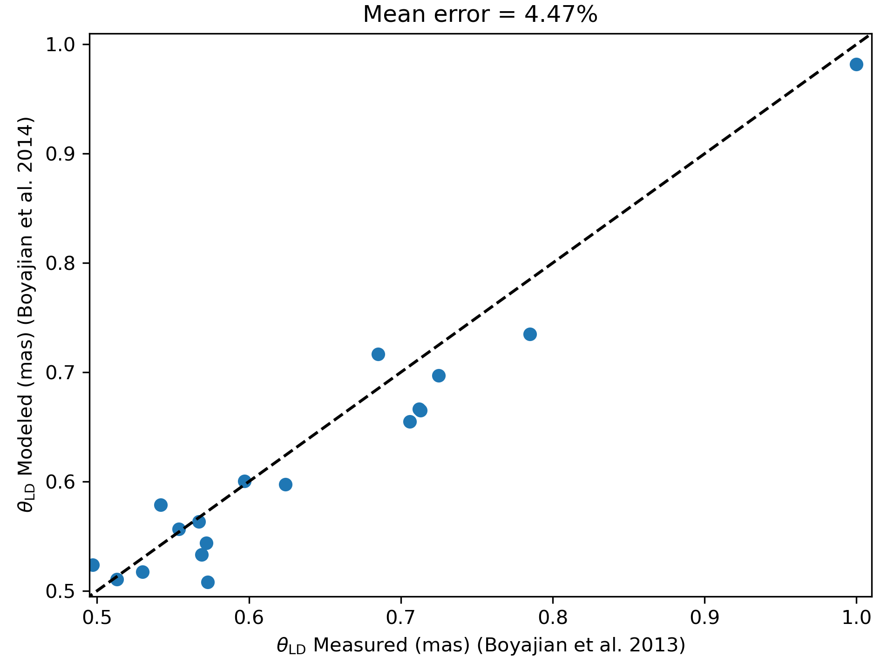

   Measured stellar diameters (from [Boyajian2013]_) vs. modeled diameters (using model from [Boyajian2014]_) for 18 EXOCAT1 targets.  The dashed black line has slope=1 for reference.

The measurements and model have excellent agreement, with average errors below 5%. As an additional check, we consider the stellar radius predicted by the Stefan-Boltzmann law:

    .. math::
    
        R_\star = \sqrt{\frac{L_\star}{4\pi \sigma_{SB} T_\mathrm{eff}^4}}

where :math:`L_\star` is the star's bolometric luminosity as :math:`\sigma_{SB}` is the Stefan-Boltzmann constant, with a value of 5.67 :math:`\times 10^{-8}` W m :math:`^{-2}` K :math:`^{-4}`.  Again relying on the [Ballesteros2012]_ model for effective temperature (see :ref:`modelingir`), we can compute the stellar radii (taking 1 solar luminosity to be 3.828 :math:`\times 10^{26}` W as per IAU 2015 Resolution B3) and then convert them to stellar angular diameters as:

    .. math::
    
        \theta = 2\tan^{-1}\left(\frac{R_\star}{d}\right)

We compare this calculation with the [Boyajian2014]_ model for all targets in EXOCAT1, with the results shown in :numref:`fig:boyajian_model_v_stefan-boltzmann`.  The two calculations have excellent agreement, with mean errors of about 7.55%, despite the very large assumptions being made in the use of the Stefan-Boltzmann law. 

.. _fig:boyajian_model_v_stefan-boltzmann:
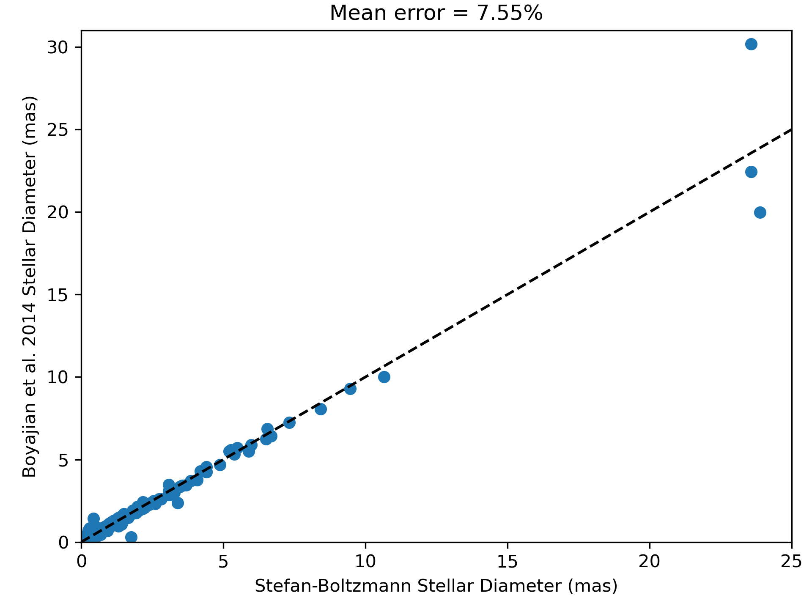

   Stellar diameters computed from Stefan-Boltzmann law vs. modeled as in [Boyajian2014]_ for 2193 stars.  The dashed black line has slope=1 for reference.

.. _zodi:

Zodiacal Light
=================================

The local zodiacal light represents an important background noise source for all imaging observations, and one of the few that we have any control over when scheduling observations (as the light intensity depends on the orientation of the look vector with respect to the sun). Following [Stark2014]_ and [Stark2015]_, ``EXOSIMS`` uses tabulated data from [Leinert1998]_ (specifically Tables 17 and 19) to model the wavelength- and orientation-dependent variation in the zodiacal light. :numref:`fig:zodi_intensity_leinert17` shows the data from [Leinert1998]_ Table 17, linearly interpolated in solar ecliptic longitude (:math:`\Delta\lambda_\odot`) and ecliptic latitude (:math:`\beta_\odot`) corresponding to the target look vector (i.e., observatory to target line of sigh unit vector) and converted to units of  :math:`\textrm{ photons m}^{-2}\textrm{ s}^{-1}\, \textrm{nm}^{-1}  \textrm{as}^{-2}` (cf. [Leinert1998]_ Fig. 37 and [Keithly2020]_ Fig. 6). This represents the zodiacal light specific intensity at a wavelength of 500 nm. 

.. _fig:zodi_intensity_leinert17:
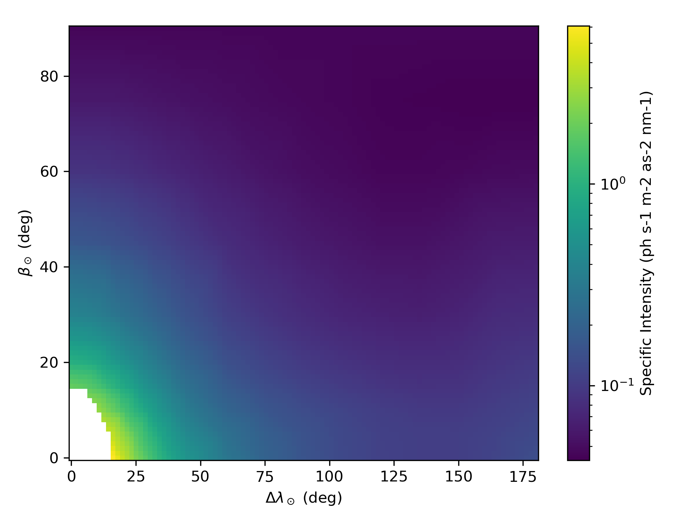

   Variation in Zodiacal light specific intensity with look vector orientation.  Data from [Leinert1998]_, Table 17.

.. _fig:zodi_color_leinert19:
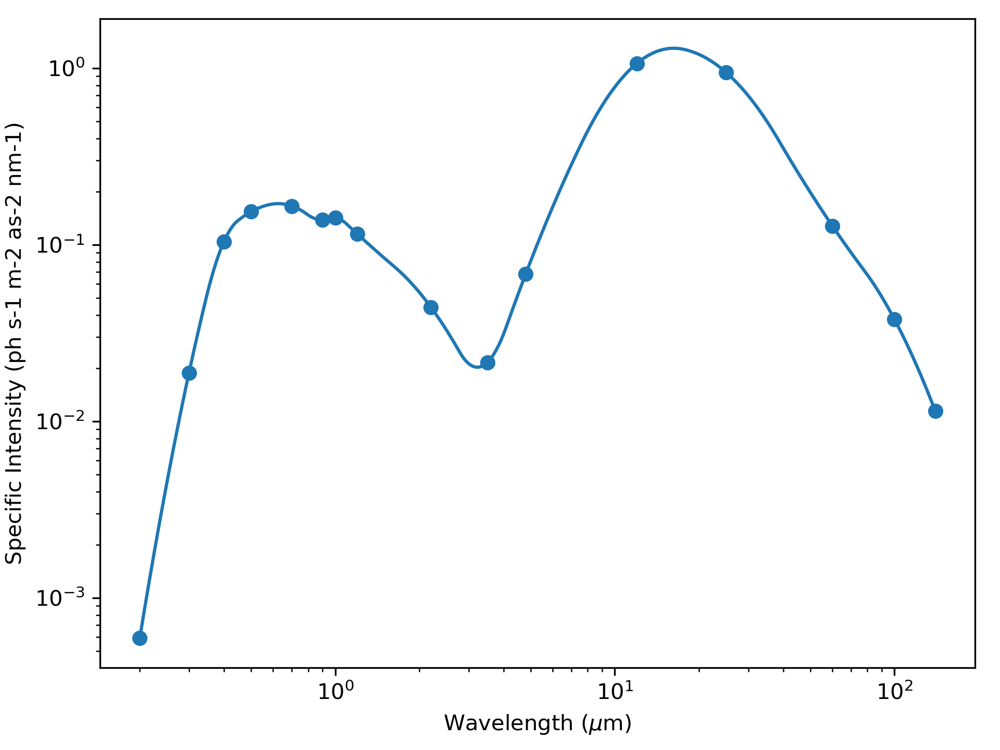

   Variation in Zodiacal light specific intensity with wavelength.  Data from [Leinert1998]_, Table 19.

:numref:`fig:zodi_color_leinert19` shows the data from [Leinert1998]_ Table 19, converted to units of  :math:`\textrm{ photons m}^{-2}\textrm{ s}^{-1}\, \textrm{nm}^{-1}  \textrm{as}^{-2}` along with a quadratic interpolant in log space (cf. [Leinert1998]_ Figs. 1 and 38 and [Keithly2020]_ Fig. 9). This represents the  zodiacal light specific intensity at an ecliptic latitude of 0 and solar ecliptic longitude of :math:`90^\circ` as a function of wavelength. 

We define the interpolant from :numref:`fig:zodi_intensity_leinert17` as :math:`I^V_{\textrm{zodi},\mf r}(\Delta\lambda_\odot, \beta_\odot)` and the interpolant from :numref:`fig:zodi_color_leinert19` as :math:`I_{\textrm{zodi},\lambda}`.  Together, they allow us to compute the specific intensity of the local zodiacal light for a given observation as:

    .. math::
    
        I_\textrm{zodi}(\Delta\lambda_\odot, \beta_\odot, \lambda_0) = I_{\textrm{zodi},\mf r}(\Delta\lambda_\odot, \beta_\odot)\frac{I_{\textrm{zodi},\lambda}(\lambda_0)}{I_{\textrm{zodi},\lambda}(500\textrm{ nm})}

.. _exozodi:

Exozodiacal Light
=================================

The EXOSIMS calculation of exozodiacal light surface brightness is based on the calculation from [Stark2014]_ and rederived here for clarity.
We begin with the scaling relation given in equation C1 of [Stark2014]_ for the specific intensity (surface brightness) :math:`I_*^V` of an exozodiacal disk around a star:

.. math::

    I^V_*(r) \propto F_*^V \tau(r)

where :math:`\tau` is the optical depth at circumstellar distance :math:`r` and :math:`F_*^V` is the V-band flux of the star.

We then assume that the optical depth of the solar system at 1 AU will be equal to the optical depth of the Earth-equivalent instellation distance (EEID) for other stars and solve for the exozodiacal disk surface brightness at EEID:

.. math::

    \begin{align}
    \tau(\text{EEID}) &= \frac{I_\odot^{V}(r=1\ \text{AU})}{F_\odot^V(r=1\ \text{AU})} = \frac{I_*^{V}(\text{EEID})}{F_*^V(\text{EEID})} \\
    I^V_*(\text{EEID}) &= \frac{F_*^V(\text{EEID})}{F_\odot^V(r=1\ \text{AU})} I_\odot^{V}(r=1\ \text{AU})
    \end{align}

The EEID distance can now be calculated using the bolometric stellar luminosity :math:`L_*` and the bolometric solar luminosity :math:`L_\odot`:

.. math::

    d = 1\ \text{AU} \sqrt{\frac{L_*}{L_\odot}}

and used to express the V band flux ratios in terms of both bolometric and V-band luminosities:

.. math::

    \begin{align}
    F_*^V(r=\text{EEID}) &= \frac{L_*^V}{4 \pi (\text{EEID})^2} = \frac{L_*^V}{4 \pi \left(1\ \text{AU} \sqrt{\frac{L_*}{L_\odot}}\right)^2} = \frac{L_*^V L_\odot}{4 \pi (1\ \text{AU})^2 L_*} \\
    F_\odot^V(r=1\ \text{AU}) &= \frac{L_\odot^V}{4 \pi (1\ \text{AU})^2} \\
    \frac{F_*^V(r=\text{EEID})}{F_\odot^V(r=1\ \text{AU})} &= \frac{L_*^V}{L_\odot^V} \frac{L_\odot}{L_*}.
    \end{align}

We can express the V-band luminosity ratio in terms of absolute V band magnitudes:

.. math::

    \frac{L_*^V}{L_\odot^V} = 10^{-0.4(M_*^V - M_\odot^V)}

which leads to equation C4 from [Stark2014]_:

.. math::

    I^V_*(r=\text{EEID}) = 10^{-0.4 (M_*^V - M_\odot^V)} \left(\frac{L_\odot}{L_*}\right) I_\odot^{V}(r=1\ \text{AU}).

To calculate the :math:`I^V_\odot` term requires an assumed exozodiacal surface brightness magnitude at EEID which is settable with the :code:`magEZ` parameter in EXOSIMS. In [Stark2014]_ the magnitude is given as :math:`x=22 \text{ mag arcsec}^{-2}` which is the default in EXOSIMS.
The V band spectral flux density of the exozodi surface is calculated with the standard magnitude equation:

.. math::

    F^V_\odot(r=1\ \text{AU}) = F_0^V  10^{-0.4x}

where :math:`F_0^V` is the V band zero magnitude spectral flux density. The solid angle unit needs to be added to treat this as a surface brightness, so we divide by the assumed solid angle of an arcsecond squared:

.. math::

    I^V_\odot(r=1\ \text{AU}) = \frac{F_0^V  10^{-0.4x}}{\text{arcsec}^2}.

It's important that we can calculate the surface brightness at :math:`r` values other than 1 AU, which we can do by dividing by an illumination factor of :math:`1/r^2`:

.. math::

    I^V_\odot(r) = \frac{F_0^V  10^{-0.4x}}{r^2  \text{arcsec}^2}.

With all the terms we can complete the equation from [Stark2014]_ to get the exozodiacal light surface brightness at an arbitrary distance :math:`r`:

.. math::

    I^V_*(r) = 10^{-0.4 (M_*^V - M_\odot^V)} \left(\frac{L_\odot}{L_*}\right)  \frac{F_0^V  10^{-0.4x}}{r^2  \text{arcsec}^2}

For simplicity we will assume that the bolometric luminosities are expressed in solar luminosities and drop the arcsecond squared term:

.. math::

    I^V_*(r) = F_0^V  10^{-0.4 (M_*^V - M_\odot^V)}  10^{-0.4x}  \frac{1}{L_*r^2}.

In EXOSIMS there are three terms that modify :math:`I^V_*`.
First, the number of "zodis" :math:`n_\text{EZ}` where one zodi is the amount of dust in the solar system.
Second, a color correction term :math:`f_\lambda` that accounts for the difference in specific intensity between the V band and the observing mode's band.
Third, a term :math:`f(\theta)` that accounts for the inclination of the target system.

To account for the number of zodis we simply multiply the specific intensity (surface brightness) by :math:`n_\text{EZ}`:

.. math::
    I_\text{EZ}^V(r) = n_\text{EZ} F_0^V  10^{-0.4 (M_*^V - M_\odot^V)}  10^{-0.4x}  \frac{1}{L_*r^2}

noting that we've changed the subscript from :math:`*` to :math:`\text{EZ}` to denote exozodiacal light.

To convert this V-band specific intensity to the specific intensity in the observing mode of interest we introduce the term :math:`f_\lambda` which handles that conversion for each star and observing mode we are interested in.
In this context converting means multiplying :math:`I_\text{EZ}^V(r)` by :math:`f_\lambda`, which we calculate as the ratio of specific intensity in our observing band to the specific intensity in V-band.
This seems paradoxical because that ratio includes the value we are looking for, namely the specific intensity in our observing band.
To get around that, we approximate the specific intensity using a scaling law derived from the solar system data shown in :numref:`fig:zodi_color_leinert19`.
Our scaling law takes the form:

    .. math::

        I_\text{EZ}^\lambda(\lambda) \propto F_*(\lambda) f_\text{star} + F_\text{thermal}(\lambda) f_\text{thermal}

where :math:`F_*` denotes the star's spectral flux density, :math:`F_\text{thermal}` is the spectral flux density from the dust's thermal emission, and :math:`f_\text{star}` and :math:`f_\text{thermal}` are scaling factors that convert the spectral flux densities to specific intensities.
These :math:`f` constants are calibrated by fitting to local zodiacal light's spectral dependence using data from [Leinert1998]_ shown in :numref:`fig:zodi_color_leinert19`.

.. _fig:fit_leinert_fixed_temp:
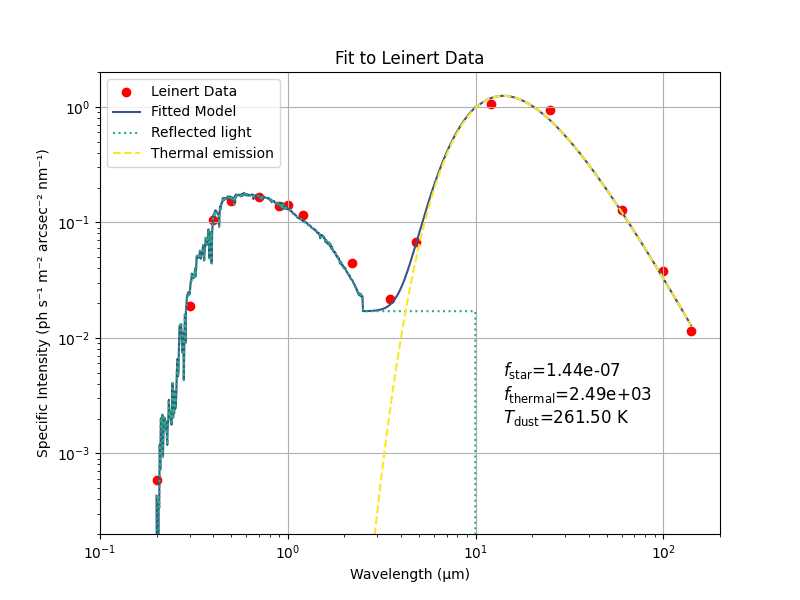

   The fit to the exozodiacal light model using calibrated constants. The reflected light is truncated at 10 microns for better model accuracy, with :math:`f_\text{star}` and :math:`f_\text{thermal}` fitted to match local zodiacal light's wavelength dependence.

The fit in :numref:`fig:fit_leinert_fixed_temp` can be recreated with the ``exozodi_fit.py`` script in the ``EXOSIMS/tools`` directory. The fit was done by loading the Sun's spectrum with synphot to use as :math:`F_*` and creating a ``SourceSpectrum`` with a ``BlackBodyNorm1D`` at 261.5 K to use as :math:`F_\text{thermal}` (261.5 K is reported as the local zodi's temperature in [Leinert1998]_). Leaving :math:`f_\text{star}` and :math:`f_\text{thermal}` free we use scipy's ``curve_fit`` function and get the result shown in :numref:`fig:fit_leinert_fixed_temp`.

With these :math:`f` constants, we can calculate the wavelength dependence of exozodi specific intensity for every star in our target list by loading each star's spectrum as :math:`F_*`.
After generating the scaling relationship for our star's specific intensity :math:`I_{\text{EZ},\lambda}`, we can generate the band-averaged specific intensity with the equation:

.. math::

   \langle I_\text{EZ}^\lambda \rangle_\text{B} = \frac{\int_\text{B} P_\lambda (\lambda) I_\text{EZ}^\lambda(\lambda)d\lambda}{\int_\text{B} P_\lambda(\lambda) d\lambda}

where B represents the mode bandpass and :math:`P_\lambda` is the bandpass throughput.
The denominator of the equation represents the bandpass equivalent width (so that we can compare bandpasses with different shapes).
This allows us to calculate the factor :math:`f_\lambda`:

.. math::

   f_\lambda = \frac{\langle I_\text{EZ}^\lambda \rangle_\text{mode}}{\langle I_\text{EZ}^\lambda \rangle_\text{V}}.

We multiply the V-band specific intensity by :math:`f_\lambda` to get the exozodi specific intensity of our target star in our mode's bandpass:

.. math::

   I_\text{EZ}(r) = I_\text{EZ}^V(r) f_\lambda =  n_\text{EZ} F_0^V  10^{-0.4 (M_*^V - M_\odot^V)}  10^{-0.4x}  \frac{f_\lambda}{L_*r^2}.

We also wish modify the specific intensity to account for the impact of the inclination of the target system. Here we have several options: We can use the empirical relationship of the local zodi's latitudinal variation from the TPF planner model by Don Lindler (2006), which was published as equation 16 of [Savransky2010]_. This has the form:

    .. math::

        f(\theta) = 2.44 − 0.0403\left(\frac{\theta}{1\textrm{ deg}}\right) + 0.000269 3\left(\frac{\theta^2}{1\textrm{ deg}^2}\right) 

where :math:`\theta \triangleq \vert 90^\circ - I\vert` and :math:`I` is the orbital inclination of the target planet (:math:`\theta \equiv \vert\beta_\odot\vert` for local zodi variations). We compare this against a similar relationship derived in [Stark2014]_ (equation B4) by fitting to the [Leinert1998]_ Table 17 data (at :math:`\Delta\lambda_\odot = 135^\circ`, where the local zodi approaches its minimum values). This has the form:

.. math::

    f(\theta) = 1.02 - 0.566 \sin\theta - 0.884 \sin^2\theta + 0.853 \sin^3\theta
        
It is important to note that the former fit is normalized at :math:`\theta = 90^\circ` while the latter is normalized at :math:`\theta = 0^\circ`. Finally, we can compare these to direct interpolants of the [Leinert1998]_ Table 17 at :math:`\Delta\lambda_\odot = 135^\circ` and :math:`90^\circ`.

.. _fig:zodi_latitudinal_variation:
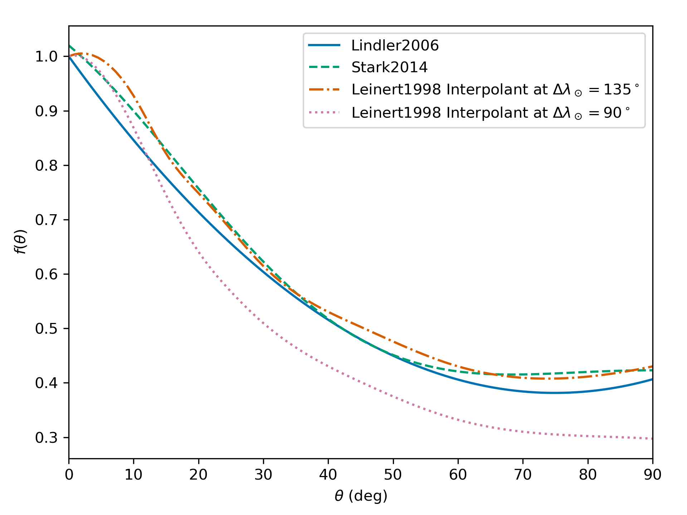

   Different models of variation in Zodiacal light with viewing angle.

:numref:`fig:zodi_latitudinal_variation` shows a comparison of the two models (with the Lindler model re-normalized at :math:`\theta = 0`) and the two interpolants.
All of these, except for the interpolant at :math:`\Delta\lambda_\odot = 90^\circ` have quite good agreement, and so we choose the Table interpolant at :math:`\Delta\lambda_\odot = 135^\circ` as our default.
This gives us the final equation for specific intensity as:

.. math::

   I_\text{EZ}(r) = I_\text{EZ}^V(r) f_\lambda f(\theta) = n_\text{EZ} F_0^V  10^{-0.4 (M_*^V - M_\odot^V)}  10^{-0.4x}  \frac{f_\lambda f(\theta)}{L_*r^2}.

To convert from specific intensity, :math:`I_\text{EZ}`, to intensity, :math:`J_\text{EZ}`, we multiply by the bandpass's equivalent width :math:`\Delta\lambda_\text{eq}` (nm) to get:

.. math::

   J_\text{EZ}(r) = I_\text{EZ}(r)\Delta\lambda_\text{eq} = n_\text{EZ} F_0^V  10^{-0.4 (M_*^V - M_\odot^V)}  10^{-0.4x}  \frac{f_\lambda f(\theta)}{L_*r^2} \Delta\lambda_\text{eq}.

which has units of :math:`\text{photons } s^{-1} m^{-2} \text{arcsec}^{-2}`. For computational reasons, it is useful to calculate :math:`J_\text{EZ}(r=1\text{ AU}, n_\text{EZ}=1)` for each mode and star in the simulation and cache them. Then, when necessary, we use the equation:

.. math::

   J_\text{EZ}(r, n_\text{EZ}, \theta) = J_\text{EZ}(r=1\text{ AU}, n_\text{EZ}=1)\frac{n_\text{EZ}}{r^2} f(\theta)

because only those three terms change when using the same input parameters. The parameters :math:`n_\text{EZ}` and :math:`\theta` are Monte Carlo draws when generating the universe and :math:`r` varies during the mission simulation as a planet orbits its star. Finally, our count rate equation takes the form:

.. math::

   C_\text{EZ} = J_\text{EZ}(r) L \Omega T

where

- :math:`J_\text{EZ}` is the exozodi intensity of the target in the mode's bandpass (:math:`\text{photons } s^{-1} m^{-2} \text{arcsec}^{-2}`)
- :math:`L` is the total attenuation due to non-coronagraphic optics, or the pupil area multiplied by photon loss terms (:math:`m^2 \text{photons}^{-1}`)
- :math:`\Omega` is the PSF core area (units of :math:`\text{arcsec}^2`)
- :math:`T` is the core throughput or occulter transmission (unitless).

.. important::

    While intensity ratios are all unitless, they will have different values at various wavelengths if evaluated in power units vs. photon units.  Therefore, the units of the intensities used to compute the ratios must match those of the intensity being scaled.  By default, ``EXOSIMS`` operates in the original units of the data (power units in the case of the [Leinert1998]_ tables) and converts to photon units as a final step, when needed. 

Scaling the specific intensity values by the optical system's field of view gives the spectral flux densities of the zodiacal and exozodiacal light. For more in-depth discussion, see [Keithly2020]_ and :ref:`ZodiacalLight`.
