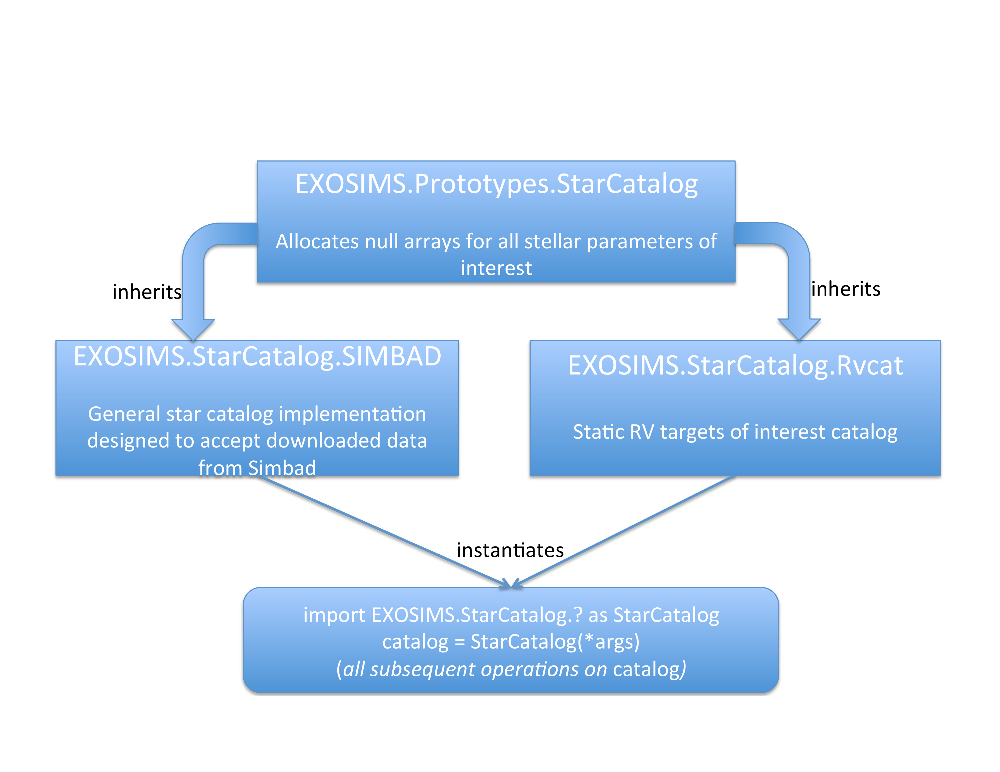

.. _exosimsmods:

Module Implementation
========================

.. _fig:starcatalog_flowdown:

   Schematic of a sample set of implementation for the ``StarCatalog`` module. The prototype (top row) is immutable, specifies the input/output structure of the module along with all common functionality, and is inherited by all ``StarCatalog`` implementations (middle row). In this case, two different catalog classes are shown: one that reads in data from a SIMBAD catalog dump, and one which contains only information about a subset of known radial velocity targets. The object used at runtime during a simulation (bottom row) is an instance of one of these three classes, is always referred to as ``StarCatalog`` in all of the code, and can be used in exactly the same way in the rest of the code due to the common input/output scheme for all required methods.

.. _fig:observatory_flowdown:
.. figure:: observatory_flowdown.png
   :width: 100.0%
   :alt: Observatory module flowdown

   Schematic of a sample set of implementations for the ``Observatory`` module. The prototype (top row) is immutable, specifies the input/output structure of the module along with all common functionality, and is inherited by all Observatory class implementations (middle row). In this case, two different observatory classes are shown that differ only in the definition of the observatory orbit. Therefore, the second implementation inherits the first (rather than directly inheriting the prototype) and overloads only the orbit method. The object used at runtime during a simulation (bottom row) is an instance of one of these classes, is always referred to as ``Observatory`` in all of the code, and can be used in exactly the same way in the rest of the code due to the common input/output scheme for all required methods.

:numref:`fig:starcatalog_flowdown` and :numref:`fig:observatory_flowdown` show schematic representations of the
three different aspects of a module, using the ``StarCatalog`` and
``Observatory`` modules as examples, respectively. Every module has a
prototype that defines the module's standard attributes and methods, including their input/output structure. 
Prototype implementation also frequently implement common functionality that is reused by all or most
implementations of that module type. The various implementations inherit the prototype and
add/overload any attributes and methods required for their particular
tasks, limited only by the preset input/output scheme for prototype methods. Finally, in the
course of running a simulation, an object is generated for each module
class selected for that simulation. The generated objects can be used interchangeably in the downstream code, regardless of what
implementation they are instances of, due to the strict interface
defined in the class prototypes. These objects are always called the generic module type throughout the code (implementation class
names are used only when specifying which modules to select for a given simulation). 

For lower level (downstream) modules, the input specification is much
more loosely defined than the output specification, as different
implementations may draw data from a wide variety of sources. For
example, the ``StarCatalog`` may be implemented as reading values from a
static file on disk, or may represent an active connection to a local or
remote database. The output specification for these modules, however, as
well as both the input and output for the upstream modules, is entirely
fixed so as to allow for generic use of all module objects in the
simulation.

