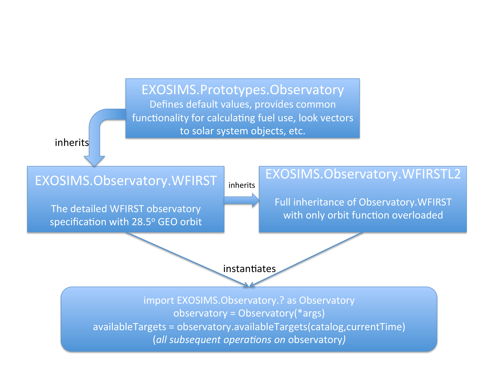

.. _exosimsmods:

Module Implementation
========================
:numref:`fig:starcatalog_flowdown` and :numref:`fig:observatory_flowdown` show schematic representations of the
three different aspects of a module, using the ``StarCatalog`` and
``Observatory`` modules as examples, respectively. Every module has a
prototype that defines the module's standard attributes and methods, including their input/output structure. 
Prototype implementations also frequently implement common functionality that is reused by all or most
implementations of that module type. The various implementations inherit the prototype and
add/overload any attributes and methods required for their particular
tasks, limited only by the preset input/output scheme for prototype methods. Finally, in the
course of running a simulation, an object is generated for each module
class selected for that simulation. The generated objects can be used interchangeably in the downstream code, regardless of what
implementation they are instances of, due to the strict interface
defined in the class prototypes. These objects are always called the generic module type throughout the code (implementation class
names are used only when specifying which modules to select for a given simulation). 

.. _fig:starcatalog_flowdown:
.. figure:: starcatalog_flowdown.png
   :width: 100.0%
   :alt: StarCatalog module flowdown

   Schematic of a sample set of implementation for the ``StarCatalog`` module. The prototype (top row) is immutable, specifies the input/output structure of the module along with all common functionality, and is inherited by all ``StarCatalog`` implementations (middle row). In this case, two different catalog classes are shown: one that reads in data from a SIMBAD catalog dump, and one which contains only information about a subset of known radial velocity targets. The object used at runtime during a simulation (bottom row) is an instance of one of these three classes, is always referred to as ``StarCatalog`` in all of the code, and can be used in exactly the same way in the rest of the code due to the common input/output scheme for all required methods.

.. _fig:observatory_flowdown:

   Schematic of a sample set of implementations for the ``Observatory`` module. The prototype (top row) is immutable, specifies the input/output structure of the module along with all common functionality, and is inherited by all Observatory class implementations (middle row). In this case, two different observatory classes are shown that differ only in the definition of the observatory orbit. Therefore, the second implementation inherits the first (rather than directly inheriting the prototype) and overloads only the orbit method. The object used at runtime during a simulation (bottom row) is an instance of one of these classes, is always referred to as ``Observatory`` in all of the code, and can be used in exactly the same way in the rest of the code due to the common input/output scheme for all required methods.

For lower level (downstream) modules, the input specification is much
more loosely defined than the output specification, as different
implementations may draw data from a wide variety of sources. For
example, the ``StarCatalog`` may be implemented as reading values from a
static file on disk, or may represent an active connection to a local or
remote database. The output specification for these modules, however, as
well as both the input and output for the upstream modules, is entirely
fixed so as to allow for generic use of all module objects in the
simulation.

.. _modinit:

Module Inheritance and Initialization
---------------------------------------

The only requirement on any implemented module is that it
inherits the appropriate prototype (either directly or by inheriting another module implementation
that inherits the prototype).  It is similarly
expected (but not required) that the prototype ``__init__`` will be called from the
``__init__`` of the newly implemented class  (if the class overloads the ``__init__`` method). 
Here is an example of the beginning of an ``OpticalSystem`` module implementation:

.. code-block:: python

   from EXOSIMS.Prototypes.OpticalSystem import OpticalSystem

   class ExampleOpticalSystem(OpticalSystem):

       def __init__(self, **specs):

           OpticalSystem.__init__(self, **specs)

           ...

.. important::
    The filename **must** match the class name for all modules.

.. important::
    If overloading the prototype ``__init__``, the implemented module's ``__init__`` method **must** have a keyword argument dictionary input (the ``**specs`` argument in the example, above).  This must be the *last* argument to the method.  See `here <https://docs.python.org/3/tutorial/controlflow.html#keyword-arguments>`__ for an explanation of the syntax, and see :ref:`sec:inputspec` for further discussion on this input.  Note that the name of the input is arbitrary, but is always ``**specs`` in the EXOSIMS prototypes.

Module Type
----------------

It is always possible to check whether a module is an instance of a
given prototype, for example:

.. code-block:: python

   isinstance(obj,EXOSIMS.Prototypes.Observatory.Observatory)

However, it can be tedious to look up all of a given object’s base
classes so, for convenience, every prototype will provide a private
variable ``_modtype``, which will always return the name of the
prototype and should not be overwritten by any module code. Thus, if the
above example evaluates as ``True``, ``obj._modtype`` will be equal to
``Observatory``.

Callable Attributes
-----------------------

Certain module attributes may be represented in a way that allows them
to be parametrized by other values. For example, the instrument
throughput and contrast are functions of both the wavelength and the
angular separation, and so must be encodable as such in the ``OpticalSystem``. 
To accommodate this, as well as simpler descriptions
where these parameters may be treated as static values, these and other
attributes are defined as ‘callable’. This means that they must be set
as objects that can be called in the normal Python fashion, i.e.,
``object(arg1,arg2,...)``.

These objects can be function definitions defined in the code, or
imported from other modules. They can be `lambda
expressions <https://docs.python.org/3/reference/expressions.html#lambda>`__
defined inline in the code. Or they can be callable object instances,
such as the various `scipy
interpolants <http://docs.scipy.org/doc/scipy/reference/interpolate.html>`__.
In cases where the description is just a single value, these attributes
can be defined as dummy functions that always return the same value, for
example:

.. code-block:: python

   def throughput(wavelength,angle):
        return 0.5

or, more simply:

.. code-block:: python

   throughput = lambda wavelength,angle: 0.5

.. warning::
    It is important to remember that Python differentiates between how it treats class
    attributes and methods in inheritance. If a value is originally defined
    as an attribute (such as a lambda function), then it cannot be
    overloaded by a method in an inheriting class implementation. So, if a
    prototype contains a callable value as an attribute, it must be
    implemented as an attribute in all inheriting implementations that wish
    to change the value. For this reason, the majority of callable
    attributes in prototype modules are instead defined as methods to avoid
    potential overloading issues.

Units
----------

All attributes/variables representing quantities with units are encoded using :py:class:`astropy.units.quantity.Quantity` objects. Docstrings will often state the default unit used for quantities, but it is never necessary to assume a unit, other than for inputs (see :ref:`sec:inputspec`).

Coding Conventions
----------------------

EXOSIMS *attempts* to follow standard Python coding conventions (`PEP-8 <https://peps.python.org/pep-0008/>`__, etc.)
and it is required that all new code be `blackened <https://black.readthedocs.io/>`__. Descriptive variable and module names are strongly encouraged. Documentation of existing modules follows the `Google docstring style <https://sphinxcontrib-napoleon.readthedocs.io/en/latest/example_google.html>`__, although the `NumPy style <https://numpydoc.readthedocs.io/en/latest/format.html>`__ is acceptable for new contributions. For more details, see :ref:`docstrings`.  

The existing codebase (as it was written by many different contributors) contains a wide variety of naming conventions and naming styles, including lots of CamelCase and mixedCase names.  The project PI thinks these look pretty and is firmly unapologetic on this point.

.. _icd:

Interface Specification
========================

The docstrings for the prototypes (see :ref:`sec:framework`) are the interface control documentation (ICD) for ``EXOSIMS``. 

.. warning::

    Module implementations overloading a prototype method may **not** modify the calling syntax to the method.  Doing so will almost invariably cause the new module to not function properly within the broader framework and will almost certainly cause unit tests to fail for that implementation.

New implementations must adhere to the interface specification, and should seek to overload as few methods as possible to produce the desired results. Any change in the method declaration in any prototype is considered interface breaking and will result in a software version bump.

