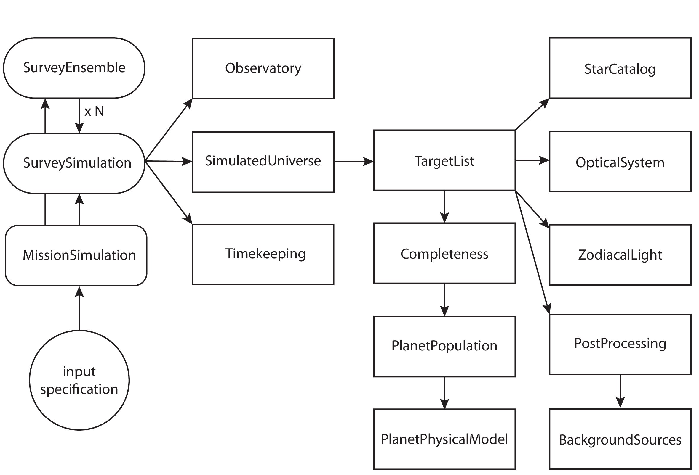

.. _intro:

Introduction
============

Building confidence in a mission concept’s ability to achieve its
science goals is always desirable. Unfortunately, accurately modeling
the science yield of an exoplanet imaging mission can be almost as complicated as
designing the mission itself. It is challenging to compare science simulation
results and systematically test the effects of changing one aspect of
the instrument or mission design.

EXOSIMS addresses this
problem by generating ensembles of mission simulations for exoplanet
direct imaging missions to estimate science yields---what is known as Monte Carlo Mission Simulation (MCMS). 
It is designed to allow systematic exploration of exoplanet imaging mission science
yields. It consists of stand-alone modules written in Python which may
be modified without requiring modifications to other portions of the
code. This allows EXOSIMS to be easily used to investigate new designs
for instruments, observatories, or overall mission designs
independently. 

Purpose and Scope
-----------------

The :term:`MCMS` approach, and many of the algorithms used by EXOSIMS are extensively described
in the academic literature (in particular in [Savransky2010]_ and [Savransky2015]_, but see also
the rest of the :ref:`refs`).
This documentation is intended to provide an overview of the
software framework of EXOSIMS and details on its component parts. 
As the software is intended to be highly reconfigurable, operational
aspects of the code are emphasized, with a focus on required input/output interfaces for 
all pieces of the framework.  Users wishing to implement their own
EXOSIMS modules should read **all** of this.  Users who only wish to use existing 
implementations to run simulations (or generate intermediate products like
synthetic planets or keepout maps, etc.) can skip to :ref:`quickstart` (but should probably also
read the :ref:`references<refs>` to understand the code's operational principles).

.. _sec:framework:

Framework
---------------------------
EXOSIMS is composed of 14 distinct object classes (called 'modules'):

-  :py:class:`~EXOSIMS.Prototypes.BackgroundSources` Encodes information about background (astrophysical confusion) sources

-  :py:class:`~EXOSIMS.Prototypes.Completeness` Provides methods for computing single-visit and dynamic completeness 

-  :py:class:`~EXOSIMS.Prototypes.Observatory` Encodes information about the observatory spacecraft (and any external occulter spacecraft) and provides methods for orbital propagation and fuel use computation

-  :py:class:`~EXOSIMS.Prototypes.OpticalSystem` Encodes everything about the science instrument(s), starlight suppression system(s), and provides methods for calculating integration times

-  :py:class:`~EXOSIMS.Prototypes.PlanetPhysicalModel` Provides models of planet physical attributes (e.g., density and albedo models)

-  :py:class:`~EXOSIMS.Prototypes.PlanetPopulation` Encodes distributions of planet physical and orbital parameters and provides methods for sampling them

-  :py:class:`~EXOSIMS.Prototypes.PostProcessing` Encodes effects of image post-processing

-  :py:class:`~EXOSIMS.Prototypes.SimulatedUniverse` Provides methods for generating synthetic universes composed of real stars and fake planets (or mixtures of real and fake planets) and encodes exosystem information

-  :py:class:`~EXOSIMS.Prototypes.StarCatalog` Input catalog of potential target stars

-  :py:class:`~EXOSIMS.Prototypes.SurveySimulation` Provides methods for scheduling and simulating full observing programs

-  :py:class:`~EXOSIMS.Prototypes.SurveyEnsemble` Provides methods for running ensembles of survey simulations

-  :py:class:`~EXOSIMS.Prototypes.TargetList` Provides methods for filtering input star catalogs into final target lists and stores all required star information for the final target list.

-  :py:class:`~EXOSIMS.Prototypes.TimeKeeping` Encodes information about mission time

-  :py:class:`~EXOSIMS.Prototypes.ZodiacalLight` Information about local and exo-zodiacal light

EXOSIMS provides a reference implementation (called 'prototypes') for each of these 14 modules, along with multiple additional implementations of most module types.  Different implementations of the modules contain specific mission design
parameters and physical descriptions of the universe, and will change
according to the mission and planet population of interest. The prototype implementations (and especially their docstrings) provide the
input/outptut specification (interface control) for the framework.  Every module implementation **must** inherit a prototype module, and any method overloading a method defined in a prototype implementation **must** conform to the inputs/outputs of the prototype method. 

In addition to the 14 modules, there is a top-level :py:class:`~EXOSIMS.MissionSim` class, used to instantiate objects of all 14 module types required to run a full simulation ensemble.  The :py:class:`~EXOSIMS.MissionSim` works with an input specification file (see :ref:`sec:inputspec`) to set input parameters throughout all of the modules.

The overall framework of EXOSIMS is depicted in :numref:`fig:instantiation_tree`, which shows all of the component
software modules in the order in which they are instantiated.  Instantiating a :py:class:`~EXOSIMS.MissionSim`  object will automatically instantiate 14 objects (accessible as attributes of the :py:class:`~EXOSIMS.MissionSim`). 

.. _fig:instantiation_tree:

   
   Schematic depiction of the instantiation order of all EXOSIMS modules. The arrows indicate calls to the object constructor, and object references to each module are always passed up directly to the top calling module, so that a given module has access to any other module connected to it by a direct path of instantiations. For example, the :py:class:`~EXOSIMS.Prototypes.TargetList` module has access to both the :py:class:`~EXOSIMS.Prototypes.PostProcessing` and :py:class:`~EXOSIMS.Prototypes.BackgroundSources` modules, while the :py:class:`~EXOSIMS.Prototypes.Observatory` module does not have access to any other modules. The typical entry point to EXOSIMS is the construction of a :py:class:`~EXOSIMS.MissionSim` object, which causes the instantiation of the :py:class:`~EXOSIMS.Prototypes.SurveySimulation` module, which in turn instnatiates all the other modules. In the case of a parallelized :py:class:`~EXOSIMS.Prototypes.SurveyEnsemble` instnatiation, multiple, independent :py:class:`~EXOSIMS.Prototypes.SurveySimulation` modules are instantiated at the same time. At the end of construction, the :py:class:`~EXOSIMS.MissionSim` and :py:class:`~EXOSIMS.Prototypes.SurveySimulation` objects have direct access to all other modules as their attributes.

Objects of all module classes can be instantiated independently,
although most modules require the instantiation of other modules during
their initialization---generating an object of any type will also generate objects of
all downstream module classes, as depicted in  :numref:`fig:instantiation_tree`.
The upstream
modules (including :py:class:`~EXOSIMS.Prototypes.TargetList`, :py:class:`~EXOSIMS.Prototypes.SimulatedUniverse`, :py:class:`~EXOSIMS.Prototypes.SurveySimulation`, and :py:class:`~EXOSIMS.Prototypes.SurveyEnsemble`) use attributes and methods from
downstream modules and perform mission simulation tasks. Any module may
perform any number or kind of calculations using any or all of the input
parameters provided to the full framework. The specific implementations are only constrained
by their input and output specification, as encoded by the prototypes.  When creating new
implementations, it can always be assumed that a module of a given type has access to 
all downstream module objects at runtime.

Terminology
----------------
The terminology used to describe the EXOSIMS software is loosely
based upon object-oriented programing (OOP) terminology, and, in particular on
the Python language and conventions. The term module can
refer to the object class prototype representing the abstracted
functionality of one piece of the software, an implementation of this
object class which inherits the attributes and methods of the prototype,
or an instance of this class. Input/output definitions of modules refer
to the class prototype. Implemented modules refer to the inherited class
definition. Passing modules (or their outputs) means the instantiation
of the inherited object class being used in a given simulation. Relying
on strict inheritance for all implemented module classes provides an
automated error and consistency-checking mechanism. The outputs of a
given object instance may be compared to the outputs of the prototype.
It is trivial to pre-check whether a given module implementation will
work within the larger framework, and this approach allows for
flexibility and adaptability.  

.. _exosimsdirs:

Directory Layout
--------------------

The EXOSIMS repository directory structure is:
::

    EXOSIMS/
    │
    ├── EXOSIMS/
    │   ├── BackgroundSources/
    │   ├── Completeness/
    │   ├── Observatory
    │   ├── OpticalSystem 
    │   ├── PlanetPhysicalModel
    │   ├── PlanetPopulation
    │   ├── PostProcessing
    │   ├── Prototypes
    │   ├── Scripts
    │   ├── SimulatedUniverse
    │   ├── StarCatalog
    │   ├── SurveyEnsemble
    │   ├── SurveySimulation
    │   ├── TargetList
    │   ├── TimeKeeping
    │   ├── ZodiacalLight
    │   ├── run
    │   └── util
    │
    ├── tests/
    │   ├── BackgroundSources/
    │   ├── Completeness/
    │   ├── Observatory
    │   ├── OpticalSystem 
    │   ├── PlanetPhysicalModel
    │   ├── PlanetPopulation
    │   ├── PostProcessing
    │   ├── Prototypes
    │   ├── SimulatedUniverse
    │   ├── StarCatalog
    │   ├── SurveyEnsemble
    │   ├── SurveySimulation
    │   ├── TargetList
    │   ├── TestModules
    │   ├── TestSupport
    │   ├── TimeKeeping
    │   ├── ZodiacalLight
    │   └── util
    │
    ├── documentation/

The top-level EXOSIMS directory (the one containing all subfolders and the ``setup.py`` file) is referred to as the EXOSIMS root directory.  The code resides in the ``EXOSIMS`` sub-folder, defining the top-level :py:mod:`EXOSIMS` package, which has 16 sub-packages.  The :py:mod:`~EXOSIMS.Prototypes` sub-package contains all of the prototype module implementations as sub-modules. Additional implementations of each module type are sub-modules to sub-packages of the same name as the module type (i.e., all Completeness implementations other than the prototype are submodules of :py:mod:`~EXOSIMS.Completeness`, etc.). The 16th sub-package is :py:mod:`~EXOSIMS.util` and contains various utilities used by the EXOSIMS modules as well as standalone analysis and plotting tools. The EXOSIMS top-level directory also contains two additiona folders that are not sub-packages of the code.  The ``Scripts`` directory contains sample and template :ref:`input specification files<sec:inputspec>`.  The ``run`` directory contains methods for parallel code execution (see :ref:`SurveyEnsemble` for more details). 

The ``tests`` directory mirrors the layout of the EXOSIMS package, with additional folders for test support code.  Further details are provided in :ref:`testing`.

