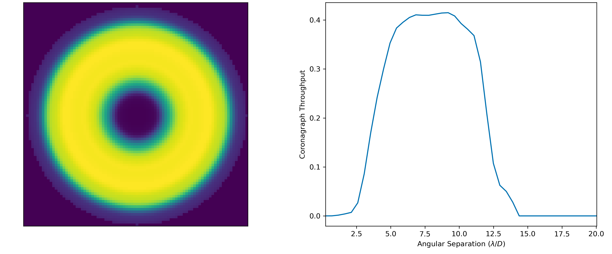
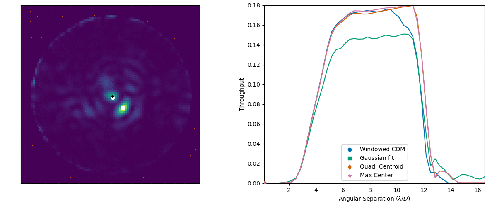
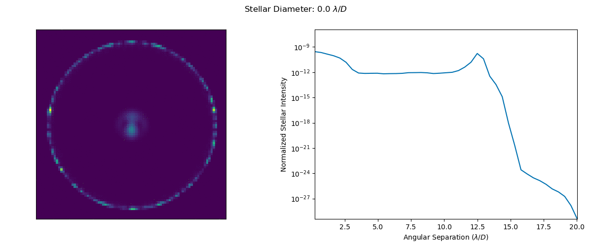

.. _opticalsystem:

OpticalSystem
================

Optical system modules describe the science instrument and starlight suppression system, and provide methods for integration time calculation.

Optical System Definition
----------------------------

An optical system is defined by the effective collecting area and three sets of objects:

* Science Instrument(s)
* Starlight Suppression System(s)
* Observing Mode(s)

Each of these is encoded as a list of dictionaries with a minimum size of 1.  A science instrument is a description of a detector and any associated optics not belonging to the starlight suppression system.  A science instrument must be classified as an imager (no spectral resolution) or a spectrometer (finite spectral resolution). A starlight suppression system is a description of all of the optics responsible for producing regions of high contrast.  It must be classified as a coronagraph (internal) or occulter (starshade; external). Finally, an observing mode is the combination of a starlight suppression system and a science instrument, along with a target :term:`SNR` for all integrations performed with that observing mode. 

The effective collecting area (:math:`A`) is the area of the primary mirror, minus all obscurations due to the secondary (and any other obscuring optics) as well as their support structures.  It is defined via three inputs:

* The primary mirror diameter (:math:`D`) - in cases of non-circular mirrors, this is the major diameter
* The obscuration factor (:math:`F_o`) - the fraction of the primary mirror area that is obscured
* The shape factor (:math:`F_s`) - defined such that the total primary mirror area is given by :math:`F_sD^2`. That is, for a circular mirror :math:`F_s = \pi/4`

Given these quantities, the effective collecting area is computed as:

.. math::

    A  = (1 - F_o)F_sD^2

Many quantities defining the optical system must be parametrizable by wavelength or angular separation (or both, or other quantities).  In cases where only a single value exists at your current design stage, these must still be structured as callable (just returning the same value regardless of input).  As an example, quantum efficiency is a function of wavelength for nearly all physical devices.  If you have not yet selected a specific device (or do not happen to have the QE curve for the device you are modeling) your QE input can be a scalar value, but will be automatically wrapped in a lambda function that always returns your constant QE value for any inputs.

In general, each dictionary describing each of these objects can have essentially any keywords in a particular implementation. This description allows for optical system definitions to be highly flexible and extensible, but can also lead to inescapable complexity.  To attempt to make the code more parsable, a few conventions are maintained, as outlined below. For all three dictionary types (``scienceInstrument``, ``starlightSuppressionSystem``, and ``observingMode``), missing required values will be filled from defaults, which are all inputs to the ``OpticalSystem`` ``__init__`` and may be modified in the :ref:`sec:inputspec`. The utility of this approach is that values that are expected to be the same for all instances of a dictionary (for example the number of detector pixels for all instruments using the same detector) can be set just once via the default, rather than needing to be set in each instrument definition.  

.. _scienceinstrument:

Science Instruments
^^^^^^^^^^^^^^^^^^^^^^

Each ``scienceInstrument`` dictionary must contain a unique ``name`` keyword.  This string must include a substring of the form ``imager`` or ``spectro``. For example, an optical system might contain science instruments called ``imager-EMCCD`` or ``spectro-CCD``, describing a photon counting electron multiplying CCD imager and a mid-resolution imaging spectrometer.  In cases where the same physical detector hardware is expected to be used in different modes (i.e., a single chip serving as an imager and polarizer, and integral field unit by the introduction of additional removable optics), you must still set up separate science instruments for each configuration.

Required Prototype Instrument Parameters
""""""""""""""""""""""""""""""""""""""""""
These values will be set from defaults if missing in the instrument dictionary.  Defaults for all instruments can be set as top-level values in the :ref:`sec:inputspec`. These top-level values also carry their own default values in the prototype implementation. 

* name (string):
    Instrument name (e.g. imager-EMCCD, spectro-CCD). Must contain the type of instrument ('imager' or 'spectro'). Every instrument must have a unique name.
* QE (callable):
    Detector quantum efficiency, parametrized by wavelength. The input value can be a scalar (fixed QE for all wavelengths) or a the full path to a file with the QE profile.  The file may be a FITS file or a CSV file.  FITS files must contain two rows (or columns) where the first represents wavelength and the second represents QE. The FITS header should specify the wavelength unit in keyword ``UNITS`` which should contain a string that is parsable as an astropy length unit (https://docs.astropy.org/en/stable/units/format.html). If the keyword does not exist, units of nm will be assumed. For CSV files, the wavelength should be in nm in a column with header ``lambda`` and the QE must be in a column with header ``QE``.  There is not required order for the two columns in a CSV file. The top-level default defaults to 0.9.
* optics (float):
    Attenuation due to optics specific to the science instrument. The top-level default defaults to 0.5. 
* sread (float):
    Detector effective read noise per frame per pixel. The top-level default defaults to 1e-6.
* idark (Quantity):
    Detector dark-current per pixel in units of 1/time. Input values are assumed to have units of 1/second. The top-level default defaults to 1e-4.
* texp (Quantity):
    Exposure time per frame in units of Time. Input values are assumed to have units of seconds. The top-level default defaults to 100.
* Rs (float):
    (Specific to spectrometers) Spectral resolving power: :math:`\lambda/\Delta\lambda`. The top-level default defaults to 50.
* lenslSamp (float):
    (Specific to spectrometers) Lenslet sampling: number of pixels per lenslet row (or column). The top-level default defaults to 2.
* pixelNumber (int):
    Detector array format, number of pixels per detector line/column. The top-level default defaults to 1000.
* pixelSize (Quantity):
    Pixel pitch in units of length.  Input values are assumed to have units of meters. The top-level default defaults to 1e-5 (10 microns). 
* FoV (Quantity):
    Angular half-field of view (i.e., field of view radius). Input values are assumed to have units of arcseconds.  The ``FoV`` value is used only for determining the maximum outer working angle in observing modes where the starlight suppression system has an infinite :term:`OWA` (or an OWA larger than the science instrument FoV). The top-level default defaults to 10.
* pixelScale (Quantity):
    Pixel scale (instantaneous field of view of each detector pixel). Input values are assumed to have units of arcseconds. The top-level default defaults to 0.02.

Field of View and Pixel Scale
""""""""""""""""""""""""""""""

Naively, the field of view and pixel scale should be related to one another. Assuming that the detector size is given by :math:`n_\textrm{pix} \times d_\textrm{pix}`, where :math:`n_\textrm{pix}` and :math:`d_\textrm{pix}`  are the ``pixelNumber`` and ``pixelSize`` values, respectively, then we can write:

   .. math::
      
      \textrm{FoV} &=  2 \tan^{-1}{\left(\frac{n_\textrm{pix} d_\textrm{pix}}{2f}\right)} \\
      \textrm{pixelScale} &=  2 \tan^{-1}{\left(\frac{ d_\textrm{pix}}{2f}\right)} 

where :math:`f` is the focal length. Note that the FoV term in these equations is the full field of view (twice the ``FoV`` parameter). From this, we can relate the two as:

   .. math::
      
      \textrm{FoV} =  2 \tan^{-1}{\left(n_\textrm{pix} \tan{\left(\frac{\textrm{pixelScale}}{2} \right)} \right)}
    

However, the detector does not necessarily set the field of view of the imaging system (especially for some coronagraphic systems) and so these must be left as independent inputs. An example of real systems where the pixel scale and field of view are and are *not* linked are the Wide-Field Instrument (WFI) and Coronagraph Instrument (CGI) on the Roman Space Telescope, respectively (see: https://roman.ipac.caltech.edu/sims/Param_db.html).  In the case of the WFI, the detectors set the field of view, whereas for the CGI, the field of view is limited by vignetting due to an aperture stop.

The field of view should always be less than or equal to the one predicted by the pixel scale. A warning will be generated if the input ``FoV`` is larger than the one computed from the ``pixelScale``, but no errors will be raised (the warning is suppressed in cases where the two quantities are approximately equal to account for numerical errors). 

.. warning::

    If using a starshade and setting the ``pixelScale`` as a top-level default or per-instrument input, it is crucial to also set the field of view to its appropriate value (otherwise the original default will be used, which may be inconsistent with the input ``pixelScale``). 

Focal Length and f-Number
""""""""""""""""""""""""""

The instrument effective focal length (encoded in instrument parameter ``focal``) can be specified either directly as a per-instrument value (in which case inputs are assumed to have units of meters) or as a per-instrument f-number input (encoded in instrument parameter ``fnumber``).  If both are given, the ``fnumber`` input is ignored and the value re-computed from the ``focal`` input.  If neither input is given, both are computed from the ``pixelScale`` and ``pixelSize`` as:

   .. math::
      
      f =  \frac{d_\textrm{pix}}{2 \tan\left(\textrm{pixelScale}/2\right)}

A warning will be generated if the input focal length (or equivalently f-number) do not approximately match this expression, but not errors will be raised. 

Photon Counting Detectors
""""""""""""""""""""""""""

The prototype detector model does not account for photon-counting detectors and their particular noise sources.  This is handled by implementation :py:class:`~EXOSIMS.OpticalSystem.Nemati`, which takes the following additional inputs (either as top-level defaults or per-instrument values):

* CIC (float):
    Clock-induced-charge per frame per pixel.
* radDos (float):
    Radiation dosage. Use of this quantity is highly specific to your particular optical system model.
* PCeff (float):
    Photon counting efficiency
* ENF (float):
    (Specific to EM-CCDs) Excess noise factor.

.. _starlightsuppressionsystem:

Starlight Suppression System
^^^^^^^^^^^^^^^^^^^^^^^^^^^^^^

Each ``starlighSuppressionSystem`` dictionary must contain a unique ``name`` keyword identifying the starlight suppression system (coronagraph or occulter). There are no special requirements for this string (unlike the ``name`` in the :ref:`scienceinstrument` dictionary).  As with the science instruments, if you are modeling a reconfigurable coronagraph (i.e., multiple filter wheels with multiple masks) you must define a separate system for each unique configuration you wish to model. Occulters operating at multiple distances must also be set up this way.

Required Prototype Starlight Suppression System Parameters
"""""""""""""""""""""""""""""""""""""""""""""""""""""""""""""""

These will be set from defaults if missing.  Defaults for all systems for some parameters can be set as top-level values in the :ref:`sec:inputspec`.

* name (string):
    System name (e.g. HLC-565, SPC-660).  By convention, this should also contain the
    central wavelength the system is optimized for (but this is not a requirement). Every system must have
    a unique name.
* optics (float):
    Attenuation due to optics specific to the coronagraph, but not captured in the various throughput values (see below). 
    This value cannot be set as a top-level default and must be a per-system value.  If missing, it defaults to 1 (no additional attenuation). 

.. important:: 

   Although they have the same name and purpose, the ``optics`` kewyord in the starlight suppression system is different from the one in the science instrument, and is not set from the top-level default.  The ``optics`` value described here can only be set on a per-system basis. 

* lam (Quantity):
    Central wavelength in units of length. Input values are assumed to be in nm. The top-level default defaults to 500.
* deltaLam (Quantity):
    Bandwidth in units of length. Input values are assumed to be in nm. This quantity has no top-level default and can only be set on a per-system basis. 
* BW (float):
    Bandwidth fraction, such that :math:`\lambda \times \textrm{BW} = \Delta\lambda`. When present, ``deltaLam`` is used preferentially. The top-level default defaults to 0.2 (20% band). 
* ohTime (Quantity):
    Overhead time for all integrations. Inputs are assumed to be in units of days. The top-level default defaults to 1.
* occulter (boolean):
    True if the system has an occulter (external or hybrid system) otherwise False (internal system). All systems have this key set to False by default.  This key has no user-settable top-level default. 
* contrast_floor (float, optional):
    An absolute limit on achievable core_contrast. Only scalar inputs (or None) are supported at this time. The top-level default defaults to None.
* IWA (Quantity):
    Inner working angle. Input values are assumed to be in units of arcsec. The top-level default defaults to 0.1.
* OWA (Quantity):
    Outer working angle. Input values are assumed to be in units of arcsec. Zero values are interpreted as infinity. Note that Python JSON also understands ``Infinity`` entries.  The top-level default defaults to Infinity.

.. warning:: 

   Any IWA/OWA values set as parameters of a starlight suppression system (or from top-level default values) will be overwritten if they disagree with angular separation ranges in table data used for other parameters.  That is, if the data file used for ``occ_trans`` or ``core_thruput``, etc., has a smallest angular separation that is larger than the currently set ``IWA`` or a largest separation that is smaller than the current system ``OWA``, then the values will be updated to match the table data.  A warning (but not error) will be generated when this happens. If no IWA/OWA inputs are supplied then both values will be set from the first data table read.

* input_angle_units (str, optional):
    The angle unit to assume for all starlight suppression system inputs that are angles (or are parametrized by an angular value).  This also applies to data in CSV files (see below for details) and FITS files (if no superseding keyword is found in the FITS header).  If None or ``LAMBDA/D`` or ``unitless`` then all angles are interpreted as :math:`\lambda/D` values. Otherwise, this string must be parsable as an astropy length unit (see: https://docs.astropy.org/en/stable/units/format.html). The top-level default defaults to 'arcsec'. The ``input_angle_units`` value is used to compute the Quantity ``syst["input_angle_unit_value"]`` which is the value of the input angle unit in physical angle units (for :math:`\lambda/D` inputs this uses the wavelength in ``syst["lam"]``). 
* core_platescale_units (str, optional):
    The angle unit to assume for ``core_platescale``.  Behaves exactly in the same way as ``input_angle_units`` but defaults to None (i.e., :math:`\lambda/D` units).
* core_platescale (float or None):
    The pixel scale (angular extent of each pixel) for the coronagraph PSF and intensity maps. Scalar inputs are assumed to have units of ``core_platescale_units``.  This must be set if using ``core_mean_intensity`` and setting a scalar input or using a CSV file. If reading from a FITS file, the value can be encoded in the header (see below). If this value is not set at the end of populating a ``starlightSuppressionSystem`` dictionary and ``core_mean_intensity`` is not None, an error will be thrown. The top-level default defaults to None.

.. important::

   It is crucial to differentiate between the :ref:`scienceinstrument` ``pixelScale`` and the starlight suppression system ``core_platescale``.  While these might be the same value, frequently they are **not** as coronagraphs may be designed independently of the selection of the final focal-plane array. Both of these values are used to determine the number of pixels in the photometric aperture, but these pixels represent two different things: The ``pixelScale`` tells you the number of detector pixels (needed for computing detector-level things like dark current and read noise).  The ``core_platescale`` tells you the number of the pixels that the ``core_mean_itensity`` was computed from, which allows you to compute the total residual starlight intensity (internally called ``core_intensity``) in the photometric aperture. 

.. note::

    Why do we have two separate unit inputs (one for ``core_platescale`` and one for everything else)? The answer, unsurprisingly, is lazy backwards compatibility.  Originaly EXOSIMS forced users to convert everything to arcseconds externally to the program, *except* (confusingly) for the coronagraphic map platescale.  To avoid breaking existing input scripts, the defaults for these inputs retain this behavior (but now allow the units to be specified however the user wishes). 

* csv_angsep_colname (str):
    Column name to use for the angular separation column for CSV data for all files. This should be correlated with the ``input_angle_units`` value (assuming your CSV files have column names that specify units). The top-level default defaults to "r_as".
* occ_trans (callable):
    Intensity transmission of extended background sources such as zodiacal light, parametrized by wavelength and angular separation. This includes the pupil mask, occulter, Lyot stop and polarizer. Input values may be scalars or full paths to files containing input data to an interpolant. The top-level default defaults to 0.2.     
* core_thruput (callable):
    System throughput in a given photometric aperture (possibly corresponding to the FWHM, set by the ``core_area`` value) of the planet PSF core, parametrized by wavelength and angular separation.  Input values may be scalars or full paths to files containing input data to an interpolant. The top-level default defaults to 0.1.
* core_area (callable):
    Area of the photometric aperture used to compute ``core_thruput`` and ``core_mean_itensity``, parametrized by wavelength and angular separation. Input values may be scalars or full paths to files containing input data to an interpolant. Input scalar values are assumed to have units of ``input_angle_units``. Outputs will be Quantities with units of :math:`\textrm{arcsec}^2`. This key has no user-settable top-level default - mssing core areas will be set as :math:`\pi/2\, (\lambda/D)^2` (the area of an aperture with radius :math:`\sqrt{2}/2\, \lambda/D`).
* core_contrast (callable):
    System contrast = mean_intensity / PSF_peak, parametrized by wavelength and angular separation. Input values may be scalars or full paths to files containing input data to an interpolant. Default values are only populated in cases where ``core_mean_intensity`` is None. The top-level default defaults to 1e-10.
* core_mean_intensity (callable):
    Mean starlight residual normalized intensity per map pixel (i.e., per pixel of the simulated PSF).  The total core intensity is computed as ``core_mean_intensity`` times the number of intensity map pixels in the photometric aperture (the number of pixels is determined from the ``core_platescale`` and ``core_area`` values). If ``core_mean_intensity`` is not specified, then the total core intensity is computed as ``core_contrast`` * ``core_thruput``. This value is parametrized by wavelength, angular separation, and angular star diameter. The diameter value defaults to 0 arcseconds (unresolved target star). If a scalar value (or CSV file, or FITS file without the relevant header keyword) is used, a ``core_platescale`` input *must* be set. This key has no user-settable top-level default and can only be set on a per-system basis.

.. important::

    The top-level default value will only be populated for ``core_contrast`` in the case where no ``core_mean_intensity`` is provided in the starlightSuppressionSystem input dictionary. If both ``core_mean_intensity`` and ``core_contrast`` are present in the input, then both will be populated, but in this case, the protoype *only* uses ``core_mean_intensity`` and ignores ``core_contrast``. However, other implementations may wish to utilize both (see, e.g., :py:class:`~EXOSIMS.OpticalSystem.Nemati_2019`). The final starlightSuppressionSystem dictionary is guaranteed to include both ``core_contrast`` and ``core_mean_intensity`` keys, but their values will be None if they were not present in the input (except for the case where neither was specified, in which case ``core_contrast`` will contain the lambda function based on the top-level default and ``core_mean_itensity`` will be None.

When using input files for ``occ_trans``, ``core_thruput``, ``core_contrast``, ``core_mean_intensity``, or ``core_area``, the file may be a FITS file or a CSV file.  For ``occ_trans``, ``core_thruput``, ``core_contrast``, and ``core_area``, FITS files must contain two rows (or columns) where the first represents angular separation and the second represents the parameter value. The FITS header should specify the angular separation unit in keyword ``UNITS`` which should either be ``unitless`` or ``LAMBDA/D`` for :math:`\lambda/D` units or contain a string that is parsable as an astropy length unit (https://docs.astropy.org/en/stable/units/format.html). If the keyword does not exist, units of ``input_angle_units`` will be assumed. For CSV files, the angular separation must be in a column with header ``csv_angsep_colname`` and the parameter value must be in a column with a header that is exactly the same as the keyword name (i.e., ``occ_trans``, etc.).  There is not a required order for the columns in a CSV file, and other columns may also be present in the same file.  For CSV files, the angular separation unit is set by key ``input_angle_units``.

For ``core_mean_intensity`` all data in FITS files **must** be in columns, with the first column containing the angular separation data. When more than two columns are present, FITS files must contain keywords of the form ``DIAM???`` where the ``???`` represent a zero-padded counter starting from 000 and up to the number of columns minus 1 (i.e., for a file with 32 columns, there are 31 intensity value columns, and we expect keywords of ``DIAM0000`` through ``DIAM030``. The values in these keywords are the stellar angular diameters in units given by the ``UNITS`` keyword.  In cases where there are only two columns present in the file, the data will be interpreted as for a stellar diameter of zero (unresolved).

.. warning::

    Stellar diameter-dependent ``core_mean_intensity`` inputs are not supported using CSV files.

CSV file inputs for ``core_mean_intensity`` are treated exactly in the same way as all other CSV inputs:  the angular separation must be in a column with header equal to ``csv_angsep_colname``, there must be a column with header ``core_mean_intensity``, which will be interpreted as the zero-diameter (unresolved) core mean intensity, and angle units are set by ``input_angle_units``.

For all 5 of these inputs (both for files and scalars), a lambda function will be generated, which takes as inputs the central wavelength of the observation and angular separation (both quantities with length and angle units, respectively). For ``core_mean_intensity``, there is a third input, representing the stellar diameter (again a quantity with angle units), which carries a default value of 0.  When the original input is a scalar value, the lambda function just returns this scalar, or zero in cases where the input angular separation is outside of the IWA/OWA range or the input wavelength is outside of the system's bandpass.  When the original input is table data, the lambda function returns the value of the interpolant defined over the table data at the relevant angular separation (and, in the case of ``core_mean_intensity``, the stellar diameter). For internal coronagraphs, the original table data represents angular separation for a particular wavelength (nominally the central wavelength of the system, stored in ``syst[lam]``, which we'll refer to as  :math:`\lambda_0`).  This is true even if the table data lists angular separation in physical angle units. If the observing wavelength does not match the system wavelength, then inputs must be scaled properly so as to evaluate the interpolant correctly.  The angular separation input to the interpolant is in physical angle units: to scale, we need to convert to :math:`\lambda/D` (for observing wavelength :math:`\lambda` - the input to the lambda function), which means dividing by :math:`\lambda/D`, and then convert back to a physical angle by scaling by :math:`\lambda_0/D`.  This is equivalent to defining our lambda function :math:`g` as: 

.. math::

    g(\lambda, s) = f\left(s\frac{\lambda_0}{\lambda}\right)

where :math:`f(s)` is the original interpolant over the table data.  To validate this, consider the case where the observing wavelength is twice the system wavelength (i.e. :math:`\lambda = 2\lambda_0`).  This results in computing the interpolated value at *half* the input angular separation.  This makes sense, as the input angular separation for the redder wavelength corresponds to a smaller angular separation for the original, bluer system definition. The same scaling is also applied to the stellar diameter for ``core_mean_intensity``. For starshades, this scaling is *not* applied. 

All of the outputs are unitless scalars, except for ``core_area``, which is returned as a quantity with units of square arcseconds.  For internal coronagraphs, the ``core_area`` output must also be scaled to account for differences in wavelength between the original system definition and the observing mode.  In this case, however, we are converting an output that is in angle units (squared) corresponding to the original wavelength :math:`\lambda_0` to a new wavelength :math:`\lambda` and so the scaling is the reciprocal of the one used for the input angular separation:

.. math::

    g(\lambda, s) = f\left(s\frac{\lambda_0}{\lambda}\right) \left(\frac{\lambda}{\lambda_0}\right)^2

Once again, this scaling is *not* applied in the case of starshades. The ``core_platescale`` is always a scalar, and is stored internally as a scalar quantity (not callable) with physical angular units corresponding to the central wavelength of the original system definition.  It must be scaled to the observing wavelength whenever used (see :py:meth:`~EXOSIMS.Prototypes.OpticalSystem.OpticalSystem.Cp_Cb_Csp_helper` for a reference implementation). 

.. warning::

    It is up to the user to ensure that angular values in physical angle units are properly computed at the central wavelength encoded in the ``lam`` parameter.  Note that this value will be filled in from a global default if no user input is supplied, which may result in discrepancies in the optical system definition and lead to unexpected behavior. Similarly, the  prototype implementation does *not* support using systems defined with one pupil diameter at a different pupil diameter.  If attempting to do this (discouraged) you must scale the angular units in your input files prior to use.

Standardized Coronagraph Parameters
"""""""""""""""""""""""""""""""""""""

Chris Stark and John Krist have a standardized definition of coronagraph parameters (described in detail here: https://starkspace.com/yield_standards.pdf) consisting of 5 FITS files.  ``EXOSIMS`` provides a utility method (:py:meth:`~EXOSIMS.util.process_opticalsys_package.process_opticalsys_package`) for translating from these files to ``EXOSIMS`` standard input files.

The sky transmission map (coronagraph mask throughput) is radially averaged and saved to a 2D FITS file of dimension :math:`n\times 2`:, where :math:`n` is the number of angular separations computed in the radial averaging (roughly one per pixel of radius about the image center in the original data). This file can then be used for input to the ``occ_trans`` system parameter.  An example is show in :numref:`fig:sky_trans_plot`

.. _fig:sky_trans_plot:

    
   Input sky transmission map (left) and output coronagraph throughput curve (right).

The off-axis :term:`PSF` data is processed by finding the center of each PSF and then computing the total flux in an aperture around the center.  The center is either found by computing the center of mass of an upsampled (by default by a factor of 4) copy of the input data, with an overlaid Hamming window overlaid at the location of the astrophysical PSF offset, or by fitting a 2D Gaussian to the upsampled (but non-windowed) image.  In the former case, the throughput is computed in a fixed aperture (with default radius of :math:`\sqrt{2}/2\, \lambda/D`).  In the latter case, the throughput is computed within an area defined by the average of the :term:`FWHM` values of the two axes of the fit Gaussian. It is also possible to specify a minimum photometric aperture in the case of Gaussian fits (via keyword ``use_phot_aperture_as_min``). 

.. _fig:offaxpsf_thruput_anim:

    
   Input off-axis PSF data (left) and output throughput curves (right) for multiple different processing options. The black + symbol indicates the astrophysical offset of the PSF in the input data.

:numref:`fig:offaxpsf_thruput_anim` shows an animation of the off-axis PSF centroiding and aperture photometry procedure and resulting throughput curves for a sample data set.  The two methods implemented in :py:meth:`~EXOSIMS.util.process_opticalsys_package.process_opticalsys_package` (windowed center of mass and Gaussian fitting of upsampled images) are compared with quadratic centroiding and aperture photometry via the ``photutils`` package (https://photutils.readthedocs.io/).  In all cases except for the Gaussian fit, a fixed aperture size of :math:`\sqrt{2}/2\,\lambda/D` is used.  The Gaussian fit, in this case, typically generates a smaller FWHM measurement, resulting in a lower computed throughput. We can see that all fitting procedures fail, to varying degrees, when the PSF is partially or fully obscured by the coronagraphic masks or when it moves outside the field of view of the system. However, the 'true' throughput values in all such cases are near zero (and contrast is similarly negligible), and so these fitting errors will have no impact on simulations.   The resulting throughput curve is saved to a 2D FITS file of dimension :math:`m\times 2`, where :math:`m` is the number of discrete astrophysical offsets in the original data set (i.e., the dimension of the data in the ``offax_psf_offset_list`` input. This file is then used as the input to the ``core_thruput`` parameter. In addition the area of the photometric aperture used in these computation is written out to a separate file (of the same dimensionality) to be used for the ``core_area`` input.  In cases where a fixed aperture is used, all values of the core area file are identical, and the file can be replaced with a scalar input. However, the values will differ for Gaussian fits. 

Finally, the stellar intensity data is processed by computing a radial average at each stellar diameter used.  The results are written to a FITS file of dimension :math:`k+1\times n`, where :math:`k` is the number of stellar diameters in the original data (i.e., the dimension of the ``stellar_intens_diam_list`` input) and math:`n` is again the number of angular separations computed in the radial averaging.  In cases where the image size of the stellar intensity maps is the same as that of the sky transmission map (and with the same center pixel), then these two :math:`n` values should be identical.  The first row of the data is the angular separations of the radial average.  The stellar diameters themselves are written to the FITS header in keywords of the form ``DIAM???`` where the ``???`` represents a zero-padded number.  So, if there are 31 discrete stellar diameters in the input data set, then the resulting FITS header will have keywords ``DIAM000`` through ``DIAM030``.

.. _fig:stellar_intens_anim:

    
   Input stellar intensity data (left) and output intensity curves (right) for various stellar diameters. 

:numref:`fig:stellar_intens_anim` shows an animation of the stellar intensity evolution as a function of stellar diameter.

Observing Mode
^^^^^^^^^^^^^^^^^^^^^^

An observing mode is the combination of a science instrument with a starlight suppression system along with rules for determining integration times. The observing mode can also specify additional parameters overwriting the values in the two sub-systems. One observing mode in the optical system must be tagged as the default detection mode (by setting boolean keyword ``detectionMode`` to True).  This is the mode used for all blind searches or initial target observations. If no observing mode is defined in the :ref:`sec:inputspec`, one will be created by combining the first science instrument with the first starlight suppression system.

Required Prototype Observing Mode Parameters
"""""""""""""""""""""""""""""""""""""""""""""""""""""""""""""""

Some of these will be set from defaults if missing.  Defaults for all modes for some parameters can be set as top-level values in the :ref:`sec:inputspec`.

* instName (string):
    Instrument name. Must match with the name of a defined Science Instrument. 
* systName (string):
    System name. Must match with the name of a defined Starlight Suppression System.
* detectionMode (boolean):
    True if this observing mode is the detection mode, otherwise False. Only one detection mode can be specified. If missing, this is set to False. If, after processing all observing modes, none is set as the detection mode, the first observing mode will be made the detection mode.
* SNR (float):
    Signal-to-noise ratio requirement for all observations.
* timeMultiplier (float):
    Integration time multiplier applied for this mode.  For example, if this mode requires two full rolls for every observation, the ``timeMultiplier`` should be set to 2.  The top-level default defaults to 1.
* lam (Quantity):
    Central wavelength in units of length. This may be different from the `syst[lam]` value of the starlight suppression system belonging to this mode.
* deltaLam (Quantity):
    Bandwidth in units of length
* BW (float):
    Bandwidth fraction. If both ``deltaLam`` and ``BW`` are set, ``deltaLam`` will be used preferentially, and ``BW`` will be recalculated from ``deltaLam`` and ``lam``.  

If any bandpass values are not set in the ``observingMode`` inputs, they will be inherited from the mode's starlight suppression system. Similarly, the :term:`IWA` and :term:`OWA` will be copied from the starlight suppression system. However, if the OWA is larger than the instrument `FoV`, then it will be replaced with the `FoV` value.

Upon instantiation, each ``ObservingMode`` will define its bandpass (stored in attribute ``bandpass``) as a :py:class:`~synphot.spectrum.SpectralElement` object.  The model used will be either a :py:class:`~EXOSIMS.util.photometricModels.Box1D` (default) or :py:class:`~synphot.models.Gaussian1D`, toggled by attribute ``bandpass_model``.  For a :py:class:`~EXOSIMS.util.photometricModels.Box1D` model, a step size can also be specified via attribute ``bandpass_step`` (default is 1 :math:`\mathring{A}`).  

Observing Mode Identification
"""""""""""""""""""""""""""""""""
Each observing mode dictionary includes two keys that can be used to identify the mode in any downstream bookkeeping tasks.  These are ``hex`` and ``index``.  The ``hex`` key contains the MD5 hash of the entire contents of the inputs to the mode's instrument, starlight suppression system, and the mode itself.  The hash is run over all of the keys in each dictionary, sorted by key in alphabetical order, and represents a fully unique identifier of everything related to the observing mode.  The ``index`` key is the integer value of the index of the mode dictionary in the full list of observing modes. That is, it is a value between 0 and the number of observing modes minus 1.  It represents the index of the observing mode in the :py:attr:`~EXOSIMS.Prototypes.OpticalSystem.OpticalSystem.observingModes` attribute of the optical system. As the ordering of the observing mode list is dependent on the order of the modes in the JSON script input, this index cannot be treated as a unique identifier, even in the case where two JSON scripts include exactly the same set of observing modes. However, within the context of a single simulation (or simulation ensemble) this index can be safely used to uniquely identify an observing mode. 

Initialization
^^^^^^^^^^^^^^^^^^^^^^

In order to build an optical system, the prototype ``__init__`` first assigns reserved inputs to attributes, and then collects all other inputs into a single attribute (:py:attr:`~EXOSIMS.Prototypes.OpticalSystem.OpticalSystem.default_vals`), which are also copied to the :ref:`sec:outspec`.  It then calls three methods in sequence, as shown in :numref:`fig:OS_init`.

.. _fig:OS_init:
.. mermaid:: opticalsystem_init.mmd
   :caption: OpticalSystem Prototype ``__init__``.

These are: :py:meth:`~EXOSIMS.Prototypes.OpticalSystem.OpticalSystem.populate_scienceInstruments`, :py:meth:`~EXOSIMS.Prototypes.OpticalSystem.OpticalSystem.populate_starlightSuppressionSystems` and :py:meth:`~EXOSIMS.Prototypes.OpticalSystem.OpticalSystem.populate_observingModes`, respectively.  Each of these methods is responsible for populating all of the required elements of each aspect of the optical system, and copy the input values (or substituted defaults) into the :ref:`sec:outspec`. Each method also calls (immediately before returning), a helper method of the same name with ``_extra`` appended (e.g. :py:meth:`~EXOSIMS.Prototypes.OpticalSystem.OpticalSystem.populate_scienceInstruments_extra`).  These are there to allow overloaded implementation to expand the definitions of each optical system element, and are left blank in the prototype. 

Each of the three top-level ``populate_*`` methods also creates an attribute called ``allowed_*_kws`` (e.g. ``allowed_scienceInstrument_kws``, etc.). These lists contain all keywords that are allowed for that particular dictionary type for a given optical system implementation.  If additional keywords are added via the ``*_extra`` methods, then the keyword names must be added to the relevant list as well (see :py:meth:`~EXOSIMS.OpticalSystem.Nemati.Nemati.populate_scienceInstruments_extra` for an implementation example). These lists are used to check for :ref:`sec:inputspec` consistency using method :py:meth:`~EXOSIMS.util.keyword_fun.check_opticalsystem_kws`.

.. important::

    It is up to each implementation to ensure proper handling of inputs and defaults values, to copy all new optical system elements to the ``_outspec``, and to augment the allowed_*_kws lists. 

.. warning::

    When defining an optical system that inherits another implementation (rather than directly inheriting the prototype), be sure to call all levels of the ``_extra`` methods.  That is, if the implementation you inherit has its own ``populate_scienceInstruments_extra`` and you wish to add to it, your method's first line should be something like ``super().populate_scienceInstruments_extra()``.

Optical System Methods
-------------------------

Various different optical system models will have a variety of methods, but all optical systems are expected to provide the following:

Cp_Cb_Csp
^^^^^^^^^^^^^^^^^^^^^^

This method computes the count rates (electrons or counts per unit time) for the planet (:math:`C_p`), the background (:math:`C_b`), and the residual speckle (:math:`C_{sp}`).  The last of these typically determines the systematic noise floor of the system.  In a simple optical system model, the foreground and background rates are likely entirely independent of one another (i.e.,  :math:`C_b` and :math:`C_{sp}` have no dependence on :math:`C_p`), but this is not actually a requirement.  More complicated descriptions, including those of electron-multiplying CCDs run in photon counting mode, will have clock-induced-charge coupling the foreground and background counts. Given the fundamental definitions in :ref:`photometry`, the basic elements are evaluated as follows:

* The count rate due to the star is: 

  .. math::
    
    C_\textrm{star} = F_S A \tau
  
  where :math:`F_S` is the star flux density in the observing band and :math:`\tau` accounts for all non-coronagraphic, throughput losses. The total attenuation due to any fore-optics and any relay optics in the starlight suppression system and science instrument.  This includes losses due to all reflective and transmissive elements *after* the primary, *excluding* the throughput of any coronagraphic pupil and focal plane masks. The detector :term:`QE` is also factored into this expression, either by convolution with the bandpass used to integrate :math:`F_S`, or as a scalar factor folded into :math:`\tau` (in which case the QE is evaluated at the bandpass central wavelength. Note that this expression represents the stellar count rate in the absence of the coronagraph (but including throughput losses due to all other optics up through the detector).

* The stellar residual count is:

  .. math::
    C_\textrm{speckle} = C_\textrm{star} I_\textrm{core}
  
  where :math:`I_\textrm{core}` is the coronagraph core intensity scaled by the size of the photometric aperture (this maps to the :math:`I` definition from [StarkKrist2019]_). 

* Given a star-planet difference in magnitude :math:`\Delta\mathrm{mag}` in the observing band, the planet count rate is given by:

  .. math::
    C_\textrm{planet} = C_\textrm{star} 10^{-0.4 \Delta\textrm{mag}} \tau_\textrm{core}(\lambda_0, \alpha)
    
  where :math:`\tau_\textrm{core}` is the coronagraphic core throughput, parametrized by the bandpass central wavelength (:math:`\lambda_0`) and the angular separation of the planet (:math:`\alpha`). This maps to the term $\Upsilon(x,y)$ in [StarkKrist2019]_. In the absence of a specific planet spectrum, :math:`\Delta\textrm{mag}` is assumed achromatic.

* Given the specific intensity of the local zodiacal light (:math:`I_\textrm{zodi}`), the zodiacal light count rate is:
  
  .. math::
    
    C_\textrm{zodi} = I_\textrm{zodi}\Omega \Delta\lambda \tau A \tau_\textrm{occ}

  where :math:`\Omega` is the the solid angle of the photometric aperture being used and :math:`\tau_\textrm{occ}` is the occulter transmission. This is typically parametrized in the same way as :math:`\tau_\textrm{core}` and maps to the :math:`T_{sky}(x,y)` value as defined in [StarkKrist2019]_. For further disucssion on :math:`I_\textrm{zodi}`, see: :ref:`zodi` and :ref:`zodiacallight`.

*  Given the specific intensity of the exozodiacal light (:math:`I_\textrm{exozodi}`), the exozodiacal light count rate is:
  
  .. math::
    
    C_\textrm{exozodi} = I_\textrm{exozodi}\Omega \Delta\lambda \tau A \tau_\textrm{core}

  Note that use of :math:`\tau_\textrm{core}` vs. :math:`\tau_\textrm{sky}` is a design decision for the prototype ``OpticalSystem`` and may be overridden by other ``OpticalSystem`` implementations. 

* The dark current count rate is:

  .. math::

    C_\textrm{dark} = n_\textrm{pix} \textrm{DC}

  where :math:`n_\textrm{pix}` is the number of pixels in the photometric aperture being used, while DC is the dark current rate in units of electrons/pixel/time.

* The read noise count rate is:

  .. math::

    C_\textrm{read} = n_\textrm{pix} \frac{RN}{t_\textrm{read}}

  where :math:`t_\textrm{read}` is the time of each readout and RN is the read noise in units of electrons/pixel/read.

* The speckle residual is modeled as the variance of the residual starlight that cannot be removed via post-processing.  This value (which is added in quadrature to the background to determine integration time) is defined as:

  .. math::
  
    C_\textrm{sp} = C_\textrm{speckle} \textrm{pp}(\alpha) \textrm{SF}

  where :math:`\textrm{pp}` is the post-processing factor (defined as the reciprocal of the post-process gain, such that  a reduction in speckle noise of 10x is equivalent to a pp of 0.1), parametrized by the planet's angular separation, and SF is a stability factor, used to model the overall PSF stability. Note that setting the stability factor to zero is equivalent to modeling a system with no inherent noise floor.  See: :ref:`PostProcessing`. 

Other detector-specific noise sources depend on the detector model and may include clock-induced charge, photon counting efficiency factors and degradation factors due to radiation dose and other effects. See: :py:meth:`~EXOSIMS.Prototypes.OpticalSystem.OpticalSystem.Cp_Cb_Csp`.

calc_intTime
^^^^^^^^^^^^^^^^^^^^^^

Calculate the integration time required to reach the selected observing mode's target SNR on one or more targets for a planet of given :math:`\Delta\mathrm{mag}` at a given angular separation. If the SNR is unreachable by the selected observing mode, return NaN. See::py:meth:`~EXOSIMS.Prototypes.OpticalSystem.OpticalSystem.calc_intTime`.

calc_dMag_per_intTime
^^^^^^^^^^^^^^^^^^^^^^

Calculate the maximum :math:`\Delta\mathrm{mag}` planet observable at the observing mode's target SNR with the given integration time, at the given angular separation.  This should be a strict inverse of ``calc_intTime``.  See: :py:meth:`~EXOSIMS.Prototypes.OpticalSystem.OpticalSystem.calc_dMag_per_intTime`.

ddMag_dt
^^^^^^^^^^^^^^^^^^^^^^

Calculate:

    .. math::
        
        \frac{\mathrm{d}}{\mathrm{d}t} \Delta\mathrm{mag}

This is used for integration time allocation optimization. See: :py:meth:`~EXOSIMS.Prototypes.OpticalSystem.OpticalSystem.ddMag_dt`.
