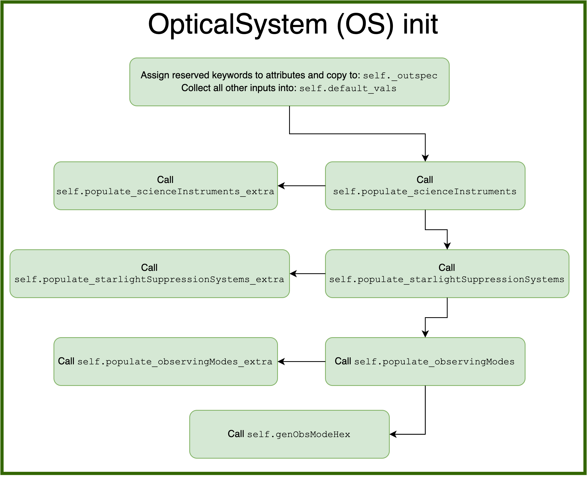

.. _opticalsystem:

OpticalSystem
================

Optical system modules describe the science instrument and starlight suppression system, and provide methods for integration time calculation.

Optical System Definition
----------------------------

An optical system is defined by the effective collecting area and three sets of objects:

* Science Instrument(s)
* Starlight Suppression System(s)
* Observing Mode(s)

Each of these is encoded as a list of dictionaries with a minimum size of 1.  A science instrument is a description of a detector and any associated optics not belonging to the starlight suppression system.  A science instrument must be classified as an imager (no spectral resolution) or a spectrometer (finite spectral resolution). A starlight suppression system is a description of all of the optics responsible for producing regions of high contrast.  It must be classified as a coronagraph (internal) or occulter (starshade; external). Finally, an observing mode is the combination of a starlight suppression system and a science instrument, along with a target :term:`SNR` for all integrations performed with that observing mode. 

The effective collecting area (:math:`A`) is the area of the primary mirror, minus all obscurations due to the secondary (and any other obscuring optics) as well as their support structures.  It is defined via three inputs:

* The primary mirror diameter (:math:`D`) - in cases of non-circular mirrors, this is the major diameter
* The obscuration factor (:math:`F_o`) - the fraction of the primary mirror area that is obscured
* The shape factor (:math:`F_s`) - defined such that the total primary mirror area is given by :math:`F_sD^2`. That is, for a circular mirror :math:`F_s = \pi/4`

Given these quantities, the effective collecting area is computed as:

.. math::

    A  = (1 - F_o)F_sD^2

Many quantities defining the optical system must be parametrizable by wavelength or angular separation (or both).  In cases where only a single value exists at your current design stage, you must still structure these aspects of the system as callable (just returning the same value regardless of input).  As an example, quantum efficiency is a function of wavelength for nearly all physical devices.  If you have not yet selected a specific device (or do not happen to have the QE curve for the device you are modeling) your QE parameter should be a callable method or lambda function that always returns the same constant QE you wish to use in your current model.

In general, each dictionary describing each of these objects can have essentially any keywords. This description allows for optical system definitions to be highly flexible and extensible, but can also lead to inescapable complexity.  To attempt to make the code more parsable, a few conventions are maintained, as outlined below.

.. _scienceinstrument:

Science Instruments
^^^^^^^^^^^^^^^^^^^^^^

Each ``scienceInstrument`` dictionary must contain a unique ``name`` keyword.  This string must include a substring of the form ``imager`` or ``spectro``. For example, an optical system might contain science instruments called ``imager-EMCCD`` or ``spectro-CCD``, describing a photon counting electron multiplying CCD imager and a mid-resolution imaging spectrometer.  In cases where the same physical detector hardware is expected to be used in different modes (i.e., a single chip serving as an imager and polarizer, and integral field unit by the introduction of additional removable optics), you must still set up separate science instruments for each operating mode.

Common science instrument attributes include:

* name (string):
    Instrument name (e.g. imager-EMCCD, spectro-CCD). Must contain the type of
    instrument (imager or spectro). Every instrument should have a unique name.
* QE (callable):
    Detector quantum efficiency, parametrized by wavelength.
* optics (float):
    Attenuation due to optics specific to the science instrument
* FoV (Quantity):
    Field of view in angle units
* pixelNumber (int):
    Detector array format, number of pixels per detector lines/columns
* pixelScale (Quantity):
    Detector pixel scale in units of angle per pixel
* pixelSize (Quantity):
    Pixel pitch in units of length
* focal (Quantity):
    Focal length in units of length
* fnumber (float):
    Detector f-number
* sread (float):
    Detector effective read noise per frame per pixel
* idark (Quantity):
    Detector dark-current per pixel in units of 1/Time
* CIC (float):
    Clock-induced-charge per frame per pixel
* texp (Quantity):
    Exposure time per frame in units of Time
* radDos (float):
    Radiation dosage. Use of this quantity is highly specific to your particular optical system model.
* PCeff (float):
    Photon counting efficiency
* ENF (float):
    (Specific to EM-CCDs) Excess noise factor
* Rs (float):
    (Specific to spectrometers) Spectral resolving power
* lenslSamp (float):
    (Specific to spectrometers) Lenslet sampling, number of pixel per
    lenslet rows or cols

.. _starlightsuppressionsystem:

Starlight Suppression System
^^^^^^^^^^^^^^^^^^^^^^^^^^^^^^

Each ``starlighSuppressionSystem`` dictionary must contain a unique name identifying the starlight suppression system (coronagraph or occulter).  As with the science instruments, if you are modeling a reconfigurable coronagraph (i.e., multiple filter wheels with multiple masks) you must define a separate system for each unique configuration you wish to model. Occulters operating at multiple distances must also be set up this way.

Common starlight suppression system attributes include:

* name (string):
    System name (e.g. HLC-565, SPC-660), should also contain the
    central wavelength the system is optimized for. Every system must have
    a unique name.
* optics (float):
    Attenuation due to optics specific to the coronagraph,
    e.g. polarizer, Lyot stop, extra fold mirrors, etc.
* lam (Quantity):
    Central wavelength in units of length
* deltaLam (Quantity):
    Bandwidth in units of length
* BW (float):
    Bandwidth fraction. When present, ``deltaLam`` is used preferentially. 
* IWA (Quantity):
    Inner working angle in units of arcsec
* OWA (Quantity):
    Outer working angle in units of arcsec
* occ_trans (callable):
    Intensity transmission of extended background sources such as zodiacal light, parametrized by angular separation.
    Includes the pupil mask, occulter, Lyot stop and polarizer.
* core_thruput (callable):
    System throughput in a given photometric aperture (possibly corresponding to the FWHM) of the planet PSF core, parametrized by angular separation.
* core_contrast (callable):
    System contrast = mean_intensity / PSF_peak, parametrized by angular separation.
* contrast_floor (float):
    An absolute limit on achievable core_contrast.
* core_mean_intensity (callable):
    Mean starlight residual normalized intensity per pixel, required to calculate
    the total core intensity as core_mean_intensity * Npix. If not specified,
    then the total core intensity is equal to core_contrast * core_thruput. Parametrized by angular separation.
* core_area (callable):
    Area of the photometric aperture used to compute core_thruput, in units of arcsec^2, parametrized by angular separation.
* core_platescale (float):
    Platescale used for a specific set of coronagraph parameters, in units
    of lambda/D per pixel
* PSF (callable):
    Point spread function - 2D ndarray of values, normalized to 1 at
    the core. Note: normalization means that all throughput effects
    must be contained in the throughput attribute. Parametrized by angular separation.
* ohTime (Quantity):
    Overhead time for all integrations. 
* occulter (boolean):
    True if the system has an occulter (external or hybrid system) otherwise False (internal system)
* occulterDiameter (Quantity):
    Occulter diameter in units of m. Measured petal tip-to-tip.
* occulterDistance (Quantity):
    Telescope-occulter separation in units of km.

Standardized Coronagraph Parameters
"""""""""""""""""""""""""""""""""""""

Chris Stark and John Krist have a standardized definition of coronagraph parameters (described in detail here: https://starkspace.com/yield_standards.pdf) consisting of 5 FITS files.  ``EXOSIMS`` provides a utility method (:py:meth:`~EXOSIMS.util.process_opticalsys_package.process_opticalsys_package`) for translating from these files to ``EXOSIMS`` standard input files.

The sky transmission map (coronagraph mask throughput) is radially averaged and saved to a 2D FITS file of dimension :math:`n\times 2`:, where :math:`n` is the number of angular separations computed in the radial averaging (roughly one per pixel of radius about the image center in the original data). This file can then be used for input to the ``occ_trans`` system parameter.  An example is show in :numref:`fig:sky_trans_plot`

.. _fig:sky_trans_plot:

    
   Input sky transmission map (left) and output coronagraph throughput curve (right).

The off-axis :term:`PSF` data is processed by finding the center of each PSF and then computing the total flux in an aperture around the center.  The center is either found by computing the center of mass of an upsampled (by default by a factor of 4) copy of the input data, with an overlaid Hamming window overlaid at the location of the astrophysical PSF offset, or by fitting a 2D Gaussian to the upsampled (but non-windowed) image.  In the former case, the throughput is computed in a fixed aperture (with default radius of :math:`\sqrt{2}/2\, \lambda/D`).  In the latter case, the throughput is computed within an area defined by the average of the :term:`FWHM` values of the two axes of the fit Gaussian. It is also possible to specify a minimum photometric aperture in the case of Gaussian fits (via keyword ``use_phot_aperture_as_min``). 

.. _fig:offaxpsf_thruput_anim:
.. figure:: offaxpsf_thruput_anim.gif
   :width: 100.0%
   :alt: Off-axis PSF
    
   Input off-axis PSF data (left) and output throughput curves (right) for multiple different processing options. The black + symbol indicates the astrophysical offset of the PSF in the input data.

:numref:`fig:offaxpsf_thruput_anim` shows an animation of the off-axis PSF centroiding and aperture photometry procedure and resulting throughput curves for a sample data set.  The two methods implemented in :py:meth:`~EXOSIMS.util.process_opticalsys_package.process_opticalsys_package` (windowed center of mass and Gaussian fitting of upsampled images) are compared with quadratic centroiding and aperture photometry via the ``photutils`` package (https://photutils.readthedocs.io/).  In all cases except for the Gaussian fit, a fixed aperture size of :math:`\sqrt{2}/2\,\lambda/D` is used.  The Gaussian fit, in this case, typically generates a smaller FWHM measurement, resulting in a lower computed throughput. We can see that all fitting procedures fail, to varying degrees, when the PSF is partially or fully obscured by the coronagraphic masks or when it moves outside the field of view of the system. However, the 'true' throughput values in all such cases are near zero (and contrast is similarly negligible), and so these fitting errors will have no impact on simulations.   The resulting throughput curve is saved to a 2D FITS file of dimension :math:`m\times 2`, where :math:`m` is the number of discrete astrophysical offsets in the original data set (i.e., the dimension of the data in the ``offax_psf_offset_list`` input. This file is then used as the input to the ``core_thruput`` parameter. In addition the area of the photometric aperture used in these computation is written out to a separate file (of the same dimensionality) to be used for the ``core_area`` input.  In cases where a fixed aperture is used, all values of the core area file are identical, and the file can be replaced with a scalar input. However, the values will differ for Gaussian fits. 

Finally, the stellar intensity data is processed by computing a radial average at each stellar diameter used.  The results are written to a FITS file of dimension :math:`k+1\times n`, where :math:`k` is the number of stellar diameters in the original data (i.e., the dimension of the ``stellar_intens_diam_list`` input) and math:`n` is again the number of angular separations computed in the radial averaging.  In cases where the image size of the stellar intensity maps is the same as that of the sky transmission map (and with the same center pixel), then these two :math:`n` values should be identical.  The first row of the data is the angular separations of the radial average.  The stellar diameters themselves are written to the FITS header in keywords of the form ``DIAM???`` where the ``???`` represents a zero-padded number.  So, if there are 31 discrete stellar diameters in the input data set, then the resulting FITS header will have keywords ``DIAM000`` through ``DIAM030``.

.. _fig:stellar_intens_anim:

    
   Input stellar intensity data (left) and output intensity curves (right) for various stellar diameters. 

:numref:`fig:stellar_intens_anim` shows an animation of the stellar intensity evolution as a function of stellar diameter.

Observing Mode
^^^^^^^^^^^^^^^^^^^^^^

An observing mode is the combination of a science instrument with a starlight suppression system along with rules for determining integration times. The observing mode can also specify additional parameters overwriting the values in the two sub-systems. One observing mode in the optical system must be tagged as the default detection mode (by setting boolean keyword ``detectionMode`` to True).  This is the mode used for all blind searches or initial target observations.

Common observing mode attributes include:

* instName (string):
    Instrument name. Must match with the name of a defined Science Instrument.
* systName (string):
    System name. Must match with the name of a defined Starlight Suppression System.
* inst (dict):
    Selected instrument of the observing mode.
* syst (dict):
    Selected system of the observing mode.
* detectionMode (boolean):
    True if this observing mode is the detection mode, otherwise False. Only one detection mode can be specified.
* SNR (float):
    Signal-to-noise ratio threshold
* timeMultiplier (float):
    Integration time multiplier applied for this mode.  For example, if this mode requires two full rolls for every observation, the timeMultiplier should be set to 2.
* lam (Quantity):
    Central wavelength in units of length
* deltaLam (Quantity):
    Bandwidth in units of length
* BW (float):
    Bandwidth fraction

If both ``deltaLam`` and ``BW`` are set, ``deltaLam`` will be used preferentially, and ``BW`` will be recalculated from ``deltaLam`` and ``lam``.  If any bandpass values are not set in the ``observingMode`` inputs, they will be inherited from the mode's starlight suppression system. Similarly, the :term:`IWA` and :term:`OWA` will be copied from the starlight suppression system, unless set in the mode's inputs.  Upon instantiation, each ``ObservingMode`` will define its bandpass (stored in attribute ``bandpass``) as a :py:class:`~synphot.spectrum.SpectralElement` object.  The model used will be either a :py:class:`~EXOSIMS.util.photometricModels.Box1D` (default) or :py:class:`~synphot.models.Gaussian1D`, toggled by attribute ``bandpass_model``.  For a :py:class:`~EXOSIMS.util.photometricModels.Box1D` model, a step size can also be specificed via attribute ``bandpass_step`` (default is 1 :math:`\mathring{A}`).  

Initialization
^^^^^^^^^^^^^^^^^^^^^^

In order to build an optical system, the prototype ``__init__`` first assigns reserved inputs to attributes, and then collects all other inputs into a single attribute (:py:attr:`~EXOSIMS.Prototypes.OpticalSystem.OpticalSystem.default_vals`), which are also copied to the :ref:`sec:outspec`.  It then calls three methods in sequence, as shown in :numref:`fig:OS_init`.

.. _fig:OS_init:

    
   OpticalSystem Prototype ``__init__``.

These are: :py:meth:`~EXOSIMS.Prototypes.OpticalSystem.OpticalSystem.populate_scienceInstruments`, :py:meth:`~EXOSIMS.Prototypes.OpticalSystem.OpticalSystem.populate_starlightSuppressionSystems` and :py:meth:`~EXOSIMS.Prototypes.OpticalSystem.OpticalSystem.populate_observingModes`, respectively.  Each of these methods is responsible for populating all of the required elements of each aspect of the optical system, and copy the input values (or substituted defaults) into the :ref:`sec:outspec`. Each method also calls (immediately before returning), a helper method of the same name with ``_extra`` appended (e.g. :py:meth:`~EXOSIMS.Prototypes.OpticalSystem.OpticalSystem.populate_scienceInstruments_extra`).  These are there to allow overloaded implementation to expand the definitions of each optical system element, and are left blank in the prototype. 

.. important::

    It is up to each implementation to ensure proper handling of inputs and defaults values, and to copy all new optical system elements to the ``_outspec``.

.. warning::

    When defining an optical system that inherits another implementation (rather than directly inheriting the prototype), be sure to call all levels of the ``_extra`` methods.  That is, if the implementation you inherit has its own ``populate_scienceInstruments_extra`` and you wish to add to it, your method's first line should be something like ``super().populate_scienceInstruments_extra()``.

Optical System Methods
-------------------------

Various different optical system models will have a variety of methods, but all optical systems are expected to provide the following:

Cp_Cb_Csp
^^^^^^^^^^^^^^^^^^^^^^

This method computes the count rates (electrons or counts per unit time) for the planet (:math:`C_p`), the background (:math:`C_b`), and the residual speckle (:math:`C_{sp}`).  The last of these typically determines the systematic noise floor of the system.  In a simple optical system model, the foreground and background rates are likely entirely independent of one another (i.e.,  :math:`C_b` and :math:`C_{sp}` have no dependence on :math:`C_p`), but this is not actually a requirement.  More complicated descriptions, including those of electron-multiplying CCDs run in photon counting mode, will have clock-induced-charge coupling the foreground and background counts. Given the fundamental definitions in :ref:`photometry`, the basic elements are evaluated as follows:

* The count rate due to the star is: 

  .. math::
    
    C_\textrm{star} = F_S A \tau
  
  where :math:`F_S` is the star flux density in the observing band and :math:`\tau` accounts for all non-coronagraphic, throughput losses. The total attenuation due to any fore-optics and any relay optics in the starlight suppression system and science instrument.  This includes losses due to all reflective and transmissive elements *after* the primary, *excluding* the throughput of any coronagraphic pupil and focal plane masks. The detector :term:`QE` is also factored into this expression, either by convolution with the bandpass used to integrate :math:`F_S`, or as a scalar factor folded into :math:`\tau` (in which case the QE is evaluated at the bandpass central wavelength. Note that this expression represents the stellar count rate in the absence of the coronagraph (but including throughput losses due to all other optics up through the detector).

* The stellar residual count is:

  .. math::
    C_\textrm{speckle} = C_\textrm{star} I_\textrm{core}
  
  where :math:`I_\textrm{core}` is the coronagraph core intensity scaled by the size of the photometric aperture (this maps to the :math:`I` definition from [StarkKrist2019]_). 

* Given a star-planet difference in magnitude :math:`\Delta\mathrm{mag}` in the observing band, the planet count rate is given by:

  .. math::
    C_\textrm{planet} = C_\textrm{star} 10^{-0.4 \Delta\textrm{mag}} \tau_\textrm{core}(\lambda_0, \alpha)
    
  where :math:`\tau_\textrm{core}` is the coronagraphic core throughput, parametrized by the bandpass central wavelength (:math:`\lambda_0`) and the angular separation of the planet (:math:`\alpha`). This maps to the term $\Upsilon(x,y)$ in [StarkKrist2019]_. In the absence of a specific planet spectrum, :math:`\Delta\textrm{mag}` is assumed achromatic.

* Given the specific intensity of the local zodiacal light (:math:`I_\textrm{zodi}`), the zodiacal light count rate is:
  
  .. math::
    
    C_\textrm{zodi} = I_\textrm{zodi}\Omega \Delta\lambda \tau A \tau_\textrm{occ}

  where :math:`\Omega` is the the solid angle of the photometric aperture being used and :math:`\tau_\textrm{occ}` is the occulter transmission. This is typically parametrized in the same way as :math:`\tau_\textrm{core}` and maps to the :math:`T_{sky}(x,y)` value as defined in [StarkKrist2019]_. For further disucssion on :math:`I_\textrm{zodi}`, see: :ref:`zodiandexozodi` and :ref:`zodiacallight`.

*  Given the specific intensity of the exozodiacal light (:math:`I_\textrm{exozodi}`), the exozodiacal light count rate is:
  
  .. math::
    
    C_\textrm{exozodi} = I_\textrm{exozodi}\Omega \Delta\lambda \tau A \tau_\textrm{core}

  Note that use of :math:`\tau_\textrm{core}` vs. :math:`\tau_\textrm{sky}` is a design decision for the prototype ``OpticalSystem`` and may be overridden by other ``OpticalSystem`` implementations. 

* The dark current count rate is:

  .. math::

    C_\textrm{dark} = n_\textrm{pix} \textrm{DC}

  where :math:`n_\textrm{pix}` is the number of pixels in the photometric aperture being used, while DC is the dark current rate in units of electrons/pixel/time.

* The read noise count rate is:

  .. math::

    C_\textrm{read} = n_\textrm{pix} \frac{RN}{t_\textrm{read}}

  where :math:`t_\textrm{read}` is the time of each readout and RN is the read noise in units of electrons/pixel/read.

* The speckle residual is modeled as the variance of the residual starlight that cannot be removed via post-processing.  This value (which is added in quadrature to the background to determine integration time) is defined as:

  .. math::
  
    C_\textrm{sp} = C_\textrm{speckle} \textrm{pp}(\alpha) \textrm{SF}

  where :math:`\textrm{pp}` is the post-processing factor (defined as the reciprocal of the post-process gain, such that  a reduction in speckle noise of 10x is equivalent to a pp of 0.1), parametrized by the planet's angular separation, and SF is a stability factor, used to model the overall PSF stability. Note that setting the stability factor to zero is equivalent to modeling a system with no inherent noise floor.  See: :ref:`PostProcessing`. 

Other detector-specific noise sources depend on the detector model and may include clock-induced charge, photon counting efficiency factors and degradation factors due to radiation dose and other effects. See: :py:meth:`~EXOSIMS.Prototypes.OpticalSystem.OpticalSystem.Cp_Cb_Csp`.

calc_intTime
^^^^^^^^^^^^^^^^^^^^^^

Calculate the integration time required to reach the selected observing mode's target SNR on one or more targets for a planet of given :math:`\Delta\mathrm{mag}` at a given angular separation. If the SNR is unreachable by the selected observing mode, return NaN. See::py:meth:`~EXOSIMS.Prototypes.OpticalSystem.OpticalSystem.calc_intTime`.

calc_dMag_per_intTime
^^^^^^^^^^^^^^^^^^^^^^

Calculate the maximum :math:`\Delta\mathrm{mag}` planet observable at the observing mode's target SNR with the given integration time, at the given angular separation.  This should be a strict inverse of ``calc_intTime``.  See: :py:meth:`~EXOSIMS.Prototypes.OpticalSystem.OpticalSystem.calc_dMag_per_intTime`.

ddMag_dt
^^^^^^^^^^^^^^^^^^^^^^

Calculate:

    .. math::
        
        \frac{\mathrm{d}}{\mathrm{d}t} \Delta\mathrm{mag}

This is used for integration time allocation optimization. See: :py:meth:`~EXOSIMS.Prototypes.OpticalSystem.OpticalSystem.ddMag_dt`.
