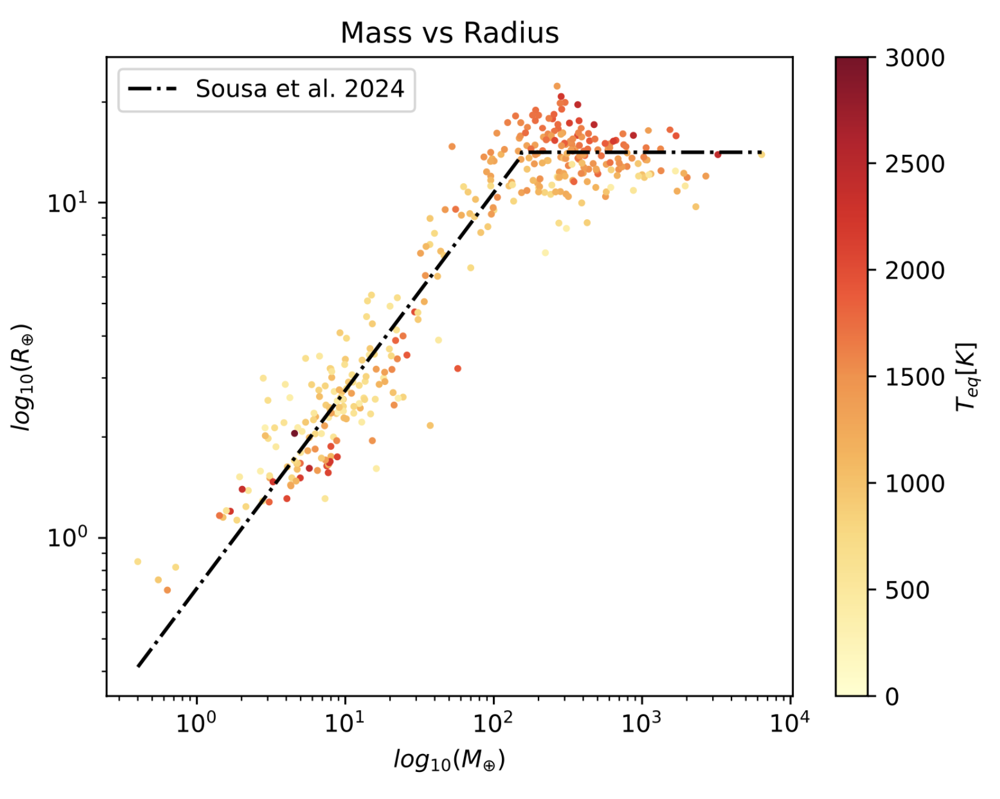

.. _planetphysicalmodel:

PlanetPhysicalModel
======================

Planet physical model modules provide methods for calculating planet properties as functions of sampled planet parameters.  These include density models (for converting between planet mass and radius) and any photometric models (for evaluating albedo/phase as a function of orbit size/location).

Density Models
----------------------

Forecaster
"""""""""""""

:py:class:`~EXOSIMS.PlanetPhysicalModel.Forecaster` provides the best-fit density models from Forecaster [Chen2016]_.  

.. warning::

    As the original sample used in this paper included many inflated, hot Jupiters, this fit will generate planets of :math:`>1\, \mathrm{M}_J` at larger separations, whihc is non-physical. 

Forecaster-mod
"""""""""""""""""
:py:class:`~EXOSIMS.PlanetPhysicalModel.ForecasterMod` provides an empirically modified version of the Forcaster best-fit density model. The original Forecaster [Chen2016]_ best fit is composed of linear (in log-log space) segments of the form  :math:`R = 10^{\mathcal{C} + \log_{10}(M)\mathcal{S}}` where :math:`R` and :math:`M` are the radius and mass, respectively, and  :math:`\mathcal{C}` and :math:`\mathcal{S}` are fit coefficients defined in four intervals of mass (Terran, Neptunian, Jovian and Stellar Worlds).  We modify the Forecaster fit as follows:
   
   * The 'Terran Worlds' fit is unchanged.
   * The 'Neptunian Worlds' fit is modified to end at the Saturn mass/radius point.  
   * A new fit is added as a straight line (in log-log space) from Saturn mass/radius to Jupiter mass/radius.
   * The 'Jovian Worlds' fit is modified to be a constant Jupiter radius value from Jupiter Mass through 0.08 solar masses.
   * The 'Stellar Worlds' fit is unchanged. 

   
The :math:`\mathcal{C}` and :math:`\mathcal{S}` parameters of this new fit are therefore:

   .. math::
    
    
    \mathcal{C} &= [ 0.00346053, -0.06613329,  0.48091861,  1.04956612, -2.84926757] \\
    \mathcal{S} &= [0.279, 0.50376436, 0.22725968, 0., 0.881]
    
for Earth mass/radius units with mass intervals:

   .. math::
    
      \mathcal{T} = [0, 2.04, 95.16, 317.828407, 26635.6863, \infty] M_\oplus
 
The radius is calculated as :math:`10^{\mathcal{C} + \log_{10}(M)\mathcal{S}}` and the modified fit looks like this:

   .. image:: modified_forecaster_fit.png
      :scale: 50 %
      :alt: modified Forecaster fit

Sousa et al. 2024
""""""""""""""""""""""

:py:class:`~EXOSIMS.PlanetPhysicalModel.ForecasterSousa` provides the mass-radius prescription from [Sousa2024]_ (shown in :numref:`fig:sousamrrelation`) who empirically derived a piecewise mass-radius function for planets with a homogeneous set of stellar parameters:

    .. math::
        \begin{split}
        \text{for } M < 159M_{\oplus} \text{: } \log_{10}\left(\frac{R}{R_{\oplus}}\right) = 0.59^{+0.01}_{-0.01}\log_{10} \frac{M}{M_{\oplus}} - 0.15^{+0.02}_{-0.02} \\
        \text{for } M > 159M_{\oplus} \text{: } \log_{10}\left(\frac{R}{R_{\oplus}}\right) = 0.00^{+0.02}_{-0.02}\log_{10} \frac{M}{M_{\oplus}} + 1.15^{+0.06}_{-0.06}
        \end{split}

.. _fig:sousamrrelation:

    
   The mass-radius relation from [Sousa2024]_ overplotted onto the planet population they derived the relation from with homogeneously derived stellar parameters from SWEET-Cat, additionally with their :math:`T_{eq}` color coded.

Fortney et al. 2007
""""""""""""""""""""""
:py:class:`~EXOSIMS.PlanetPhysicalModel.FortneyMarleyCahoyMix1` provides the planet density models from [Fortney2007]_. The relevant masses are converted to radii as follows:

    * For masses  :math:`\le 17_\oplus`, Eq. 8 (the rock/iron mixture density, as corrected in paper erratum) is used with a rock fraction of 0.67 (such that 1 Earth Mass gives 1 Earth radius). 
    * For masses :math:`> 17 M_\oplus`, Table 4 (mass-radius relationship for 4.5 Gyr planets) are interpolated, assuming a constant core mass of :math:`< 10 M_\oplus`. The mean age of stars in the subset of rows being considered here (for which age is available) is 4.64 Gyr (median of 4.27).  To avoid extrapolating beyond the available grid, semi-major axis values in the inputs are strictly truncated to the range (0.02, 9.5) AU.
    
    .. note::

        This truncation only affects a small subset of known planets, but if any of these end up on a target list, this needs to be revisited.

This fit effectively recreates the 'Terran' world leg of the modified Forecaster model, but extends it well into 'Neptunian' worlds.  Similarly, while the fits agree for Jovian and Super-Jovian objects, they have different behaviours around the location of Saturn:

    .. image:: massfits.png
        :scale: 100 %
        :alt: modified Forecaster fit vs. Fortney fit

   This approach consistently produces smaller radii for Super-Earth - Neptune planets, as compared with the modified Forecaster fit, and consistently produces larger radii for giants, as can seen in the figure below:  

    .. image:: modified_forecaster_v_Fortney.png
        :scale: 50 %
        :alt: modified Forecaster fit vs. Fortney fit

.. _planetpopulation:
   
PlanetPopulation
====================

Planet population modules encode the distributions defining a planet population, and provide methods for sampling from these distributions.

