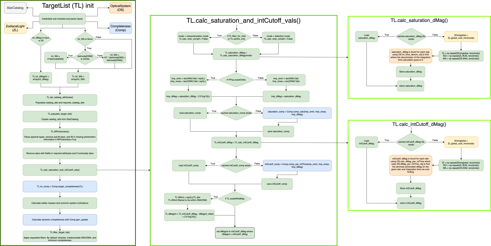

.. _starcatalog:

StarCatalog
==============

The star catalog modules are intended to be primarily static, providing only an interface between
external catalog data and ``EXOSIMS`` standards.  Any processing or augmentation of catalog data
should be done in the ``TargetList`` module.

``StarCatalog`` objects must contain equally sized arrays of stellar attributes (stored as :py:class:`numpy.ndarray` attributes).  While 
different catalogs may contain different information, a minimum set of attributes (the ones listed in the :py:class:`~EXOSIMS.Prototypes.StarCatalog` prototype) is required to run a full survey simulation. 

TargetList
=============

The target list modules take catalog data from a :ref:`StarCatalog` object and, using additional information and methods from :ref:`Completeness`, :ref:`opticalsystem`, and :ref:`zodiacallight` objects, generate an input target list for a survey simulation.  The basic functionality is fully implemented by the :py:class:`~EXOSIMS.Prototypes.TargetList` prototype, with other implementations focused on special cases, such as the :py:class:`~EXOSIMS.TargetList.KnownRVPlanetsTargetList`.  The end result is an object analogous to the :ref:`StarCatalog`, with target attributes stored in equally sized :py:class:`numpy.ndarray`\s. :numref:`fig:TL_init_flowchart` shows the initialization of the  :py:class:`~EXOSIMS.Prototypes.TargetList` prototype.

.. _fig:TL_init_flowchart:

   Initialization of a prototype TargetList.

