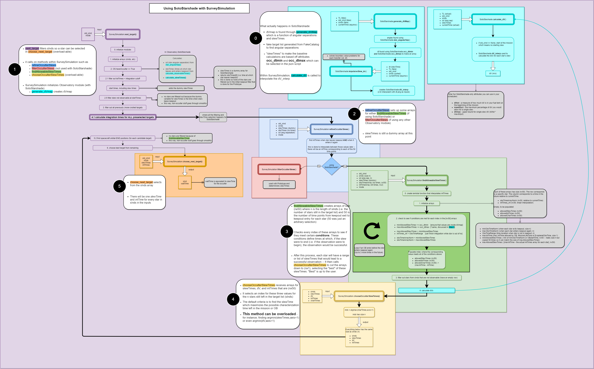

.. _starshades:

Starshades
######################

This documentation describes starshade modelling capabilities in EXOSIMS and how to work with starshades.
Starshades are an external occulter for exoplanet direct imaging that enable high contrast imaging. 
There are two implementations at the moment, using:

* the ``Observatory`` prototype with methods in the ``SurveySimulation`` prototype.
* the ``SotoStarshade`` module with methods in the ``SurveySimulation`` prototype. 

The ``SotoStarshade`` module inherits the following hierarchy: ``Observatory`` -> ``ObservatoryL2Halo``. 
Starshade fuel costs are estimated at different levels of fidelity depending on the chosen implementation.
The two main flight modes that require modeling of fuel costs are the station-keeping and slewing of a starshade. 

During station-keeping, the starshade is flying in formation with the space telescope during an observation. 
It must use fuel to keep up with the telescope's motion and line of sight (LOS) to the target star. 
An additional constraint is that the lateral position of the starshade relative to the LOS cannot exceed 1 meter.
This ensures that the desired high contrast imaging is achieved. 
Chemical propulsion engines, modeled simply using impulsive maneuvers, are typically selected to conduct observations. 
If a continuous thrust engine is used, the plume produced will reflect light throughout the entire observation. 

During slewing, the starshade is transfering to the line of sight of a new star at some future time. 
It uses fuel to initiate this transfer.
Either a chemical propulsion or continuous thrust engine can be used for these maneuver.
Continuous thrust engines (something like solar electric propulsion) typically use fuel more efficiently.
They are typically slower than chemical propulsion in achieving a desired :math:`\Delta` v and have practical limits to how fast they can reach a LOS with certain stars. 

Prototype
==========
The ``Observatory`` module contains some basic methods for estimating starshade fuel costs during orbital maneuvers. 
Note: some of the assumptions in these methods may be insufficiently accurate for fuel modeling. 

Prototype - Slew Maneuvers
------------------------------
In the method ``SurveySimulation.next_target`` we consider starshade slewing maneuvers. 
For each star left in the target list object ``TL``, a slew time is calculated using ``Observatory.calculate_slewTimes`` as shown in the following code-block:

.. code-block:: python 
    
    def calculate_slewTimes(self,TL,old_sInd,sInds,sd,obsTimes,currentTime):
       self.ao = self.thrust/self.scMass
        slewTime_fac = (2.*self.occulterSep/np.abs(self.ao)/(self.defburnPortion/2. - 
            self.defburnPortion**2./4.)).decompose().to('d2')

        if old_sInd is None:
            slewTimes = np.zeros(TL.nStars)*u.d
        else:
            slewTimes = np.sqrt(slewTime_fac*np.sin(abs(sd)/2.)) #an issue exists if sd is negative
            assert np.where(np.isnan(slewTimes))[0].shape[0] == 0, 'At least one slewTime is nan'
        
        return slewTimes

The input ``sd`` (angular separations) is calculated previously within ``SurveySimulation.next_target`` using the method ``Observatory.star_angularSep``. The method assumes a constant acceleration :math:`a_0` equal to the thrust value of the occulter slew thrust :math:`T_{occ}` 
given by the input ``Observatory.thrust`` in mN and the current occulter mass :math:`m_{occ}` ``Observatory.scMass`` in kg units. 

.. math::

   a_0 = \frac{T_{occ}}{m_{occ}}

The slew time selected for each star is then calculated using the following formula:
  
.. math::

   \Delta t_{slew} = \sqrt{\frac{2d_{occ}}{a_0 (\frac{\Delta}{2} - \frac{\Delta^2}{4})} \sin{\frac{|\psi|}{2}}}

This is a function of the following:

* :math:`d_{occ}` - the occulter separation ``Observatory.occulterSep``
* :math:`\Delta` - the default burn portion ``Observatory.defburnPortion``
* :math:`\psi` - the angular separation of the stars in ``sInds`` to ``old_sInd`` within the input ``sd``
* :math:`T_{occ}` - the slew thrust ``Observatory.thrust``
* :math:`m_{occ}` - the occulter mass ``Observatory.scMass``

Within ``SurveySimulation.next_target``, targets are filtered out of the target list depending on whether the selected slew time coincides with a star being in telescope keepout.

After a star is selected and an observation is complete, the slew has to be conducted to start the next observation. This is done using the ``Observatory.log_occulterResults`` method which is called within ``SurveySimulation.next_target`` as follows:

.. code-block:: python 
    
    def log_occulterResults(self,DRM,slewTimes,sInd,sd,dV):
        DRM['slew_time'] = slewTimes.to('day')
        DRM['slew_angle'] = sd.to('deg')
        
        slew_mass_used = slewTimes*self.defburnPortion*self.flowRate
        DRM['slew_dV'] = (slewTimes*self.ao*self.defburnPortion).to('m/s')
        DRM['slew_mass_used'] = slew_mass_used.to('kg')
        self.scMass = self.scMass - slew_mass_used
        DRM['scMass'] = self.scMass.to('kg')
        
        return DRM

This method updates the given ``DRM`` dictionary and populates it with occulter slew parameters. These include:

* 'slew_time' - or the slew time :math:`\Delta t_{slew}`
* 'slew_angle' - or the slew angle :math:`\psi`
* 'slew_mass_used' - or the slew mass used :math:`\Delta m_{slew} = \dot{m}_{slew} \Delta t_{slew} \Delta`
* 'slew_dV' - or the slew delta-v :math:`\Delta v_{slew} = a_0 \Delta t_{slew} \Delta`
* 'scMass' - or the occulter mass :math:`m_{occ,new} = m_{occ} - \Delta m_{slew}`

The mass flow rate :math:`\dot{m}_{slew}` is 

.. math::

	\dot{m}_{slew} = \frac{T_{occ}}{g_0 I_{sp,slew}}

which is a function of the attribute :math:`I_{sp,slew}` the specific impulse ``Observatory.slewIsp`` of the slewing engine. 	
The attribute ``Observatory.scMass`` is also updated by subtracting the fuel mass used. 

Prototype - Station-Keeping Maneuvers
-----------------------------------------
The station-keeping maneuvers for starshade formation flying are not used in the decision-making process of the ``SurveySimulation.Prototype`` module.
The fuel costs are only estimated and used to decrease the starshade mass accordingly after an observation is conducted. 
Station-keeping fuel usage can occur during different modes of observation, including ``det`` (detection) and ``char`` (characterization). 
The fuel costs are used in ``SurveySimulation.run_sim`` which calls the ``SurveySimulation.update_occulter_mass`` method. This method is used as follows:

.. code-block:: python 
    
    def update_occulter_mass(self, DRM, sInd, t_int, skMode):
        TL = self.TargetList
        Obs = self.Observatory
        TK = self.TimeKeeping
        
        assert skMode in ('det', 'char'), "Observing mode type must be 'det' or 'char'."
        
        dF_lateral, dF_axial, intMdot, mass_used, deltaV = Obs.mass_dec_sk(TL, \
                sInd, TK.currentTimeAbs.copy(), t_int)
        
        DRM[skMode + '_dV'] = deltaV.to('m/s')
        DRM[skMode + '_mass_used'] = mass_used.to('kg')
        DRM[skMode + '_dF_lateral'] = dF_lateral.to('N')
        DRM[skMode + '_dF_axial'] = dF_axial.to('N')

        Obs.scMass = Obs.scMass - mass_used
        DRM['scMass'] = Obs.scMass.to('kg')
        
        return DRM

In this method, a station-keeping mode is specified as an input. It then calculates station-keeping costs and uses them to update the ``DRM`` dictionary.
The dictionary entries, assuming a specific skMode, are:

* skMode + '_dV' - or the station-keeping delta-v :math:`\Delta v_{sk}`
* skMode + '_mass_used' - or the station-keeping mass used :math:`\Delta m_{sk}`
* skMode + '_dF_lateral' - or the lateral differential force on the starshade :math:`\Delta F_{lat}`
* skMode + '_dF_axial' - or the axial differential force on the starshade :math:`\Delta F_{ax}`
* 'scMass' - or the occulter mass :math:`m_{occ,new} = m_{occ} - \Delta m_{sk}`

The attribute ``Observatory.scMass`` is also updated by subtracting the fuel mass used during station-keeping regardless of the selected mode. 
``SurveySimulation.update_occulter_mass`` calls on methods from the ``Observatory.Prototype`` module. 
The main method called is ``Observatory.mass_dec_sk`` shown below:

.. code-block:: python 
    
    def mass_dec_sk(self, TL, sInd, currentTime, t_int):
        dF_lateral, dF_axial = self.distForces(TL, sInd, currentTime)
        intMdot, mass_used, deltaV = self.mass_dec(dF_lateral, t_int)
        
        return dF_lateral, dF_axial, intMdot, mass_used, deltaV

This method then calls on two separate methods within the ``Observatory.Prototype`` module.
The first is ``Observatory.distForces`` which calculates the disturbance forces on the starshade when aligned with the LOS to target star ``sInd` within target list ``TL`` at ``currentTime``. 
It first calculates the position of the telescope using ``Observatory.orbit`` and finds the net force on the telescope :math:`\Sigma \mathbf{F}_{tel}` due to the Sun and Earth gravity. 
Next, it finds the net force on the starshade as :math:`\Sigma \mathbf{F}_{occ}`. The net disturbance force is then

.. math::

	\Delta \mathbf{F} = \Sigma \mathbf{F}_{occ} - \frac{m_{occ}}{m_{tel}}\Sigma \mathbf{F}_{tel}

The method then returns two components of this disturbance force: the component lateral to the LOS :math:`\Delta F_{lat}` and the component axial to the LOS :math:`\Delta F_{ax}`.

The other method used in ``Observatory.mass_dec_sk`` is called ``Observatory.mass_dec`` which estimates fuel usage during station-keeping. 
The method is shown below:

.. code-block:: python 
    
    def mass_dec(self, dF_lateral, t_int):
        intMdot = (1./np.cos(np.radians(45))*np.cos(np.radians(5))*
                dF_lateral/const.g0/self.skIsp).to('kg/s')
        mass_used = (intMdot*t_int).to('kg')
        deltaV = (dF_lateral/self.scMass*t_int).to('km/s')
        
        return intMdot, mass_used, deltaV

It only takes two inputs, the lateral disturbance force on the starshade ``dF_lateral`` and the integration time ``t_int`` or :math:`\Delta t_{int}`.
First it calculates the mass flow rate as 

.. math::

	\dot{m}_{int} = \frac{\cos{5^\circ}}{\cos{45^\circ}} \frac{\Delta t_{int} \Delta F_{lat} }{g_0 I_{sp,sk} }

where the first cosine terms represent cosine losses and :math:`I_{sp,sk}` is the specific impulse ``Observatory.skIsp`` of the station-keeping engine. 
The fuel mass used by the starshade to station-keep throughout the integration time is then

.. math::

	\Delta m_{sk} = \dot{m}_{int} \Delta t_{int} 

and the :math:`\Delta v_{sk}` is 

.. math::

	\Delta v_{sk} = \Delta t_{int}  \frac{\Delta F_{lat}}{m_{occ}} 

The outputs of both of these methods are combined in ``Observatory.mass_dec_sk`` and used in ``SurveySimulation.update_occulter_mass`` to update the occulter mass after using fuel during an observation. 
	
	
SotoStarshade
==============

The usage of the ``Observatory.SotoStarshade`` module with ``SurveySimulation.Prototype`` is described in the diagram below. 
Clicking on the diagram will open a version in which you can zoom in and see each step more clearly.

The new ``SotoStarshade`` module introduces a higher fidelity model for starshade slewing maneuvers. 
It also doesn't use fixed slew times for each star in a target list. 
We can then explore ranges of slew times and select them strategically around mission and keepout constraints. 

.. note::
	
	The ``SotoStarshade`` module at the moment only overloads previous slewing methods in the ``Observatory.Prototype`` module.
	It therefore still uses the prototype station-keeping model described previously. 
	The ``SotoStarshade_SKi`` module contains methods for higher fidelity station-keeping costs and simulations but needs to be incorporated into ``SurveySimulation``.

0 - Slew Calculations in SotoStarshade
---------------------------------------

1 - Procedures in ``next_target``
----------------------------------

2 - Distinguishing Between ``Prototype`` and ``SotoStarshade``
---------------------------------------------------------------

3 - Finding Ranges of Slew Times 
---------------------------------

4 - Selecting a Slew Time for Each Target
------------------------------------------

5 - Choosing the Next Target
-----------------------------

SotoStarshade_SKi
=================

This is a future module that inherits the ``SotoStarshade`` module. It contains various methods for the simulation of station-keeping during an observation.

