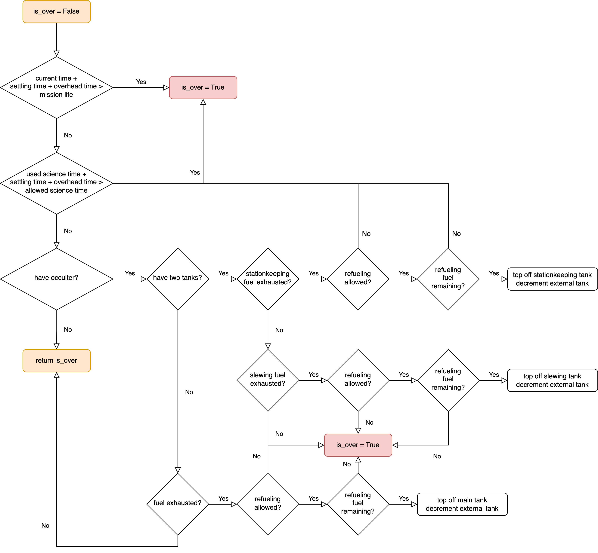

.. _timekeeping:
   
TimeKeeping
=============

Time-keeping modules keep track of mission time and provide methods for determining when observations are allowed to be scheduled based on mission rules. 

Mission End
---------------

The ``mission_is_over`` method provides functionality to determine whether a mission simulation should be stopped.  The prototype implementation (:py:meth:`~EXOSIMS.Prototypes.TimeKeeping.TimeKeeping.mission_is_over`) checks for the following:

* Whether the current time (plus overheads on the next integration) exceeds the total mission lifetime
* Whether currently bookkept time for exoplanet science (plus overheads on the next integration) exceeds the total allowable science time
* If the mission uses and occulter, whether fuel has been exhausted

If a mission description supports refueling, the test on remaining fuel is also responsible for topping off the tanks to their maximum capacities (or with however much fuel remains in the external reservoir. :numref:`fig:mission_is_over` shows the logical flow of the prototype implementation. 

.. _fig:mission_is_over:

   
   Schematic of the logical flow of the prototype :py:meth:`~EXOSIMS.Prototypes.TimeKeeping.TimeKeeping.mission_is_over` implementation.

